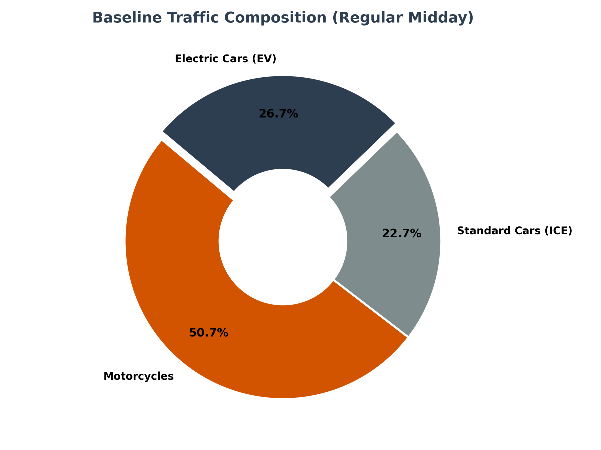
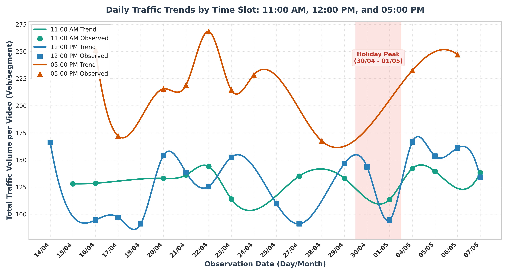
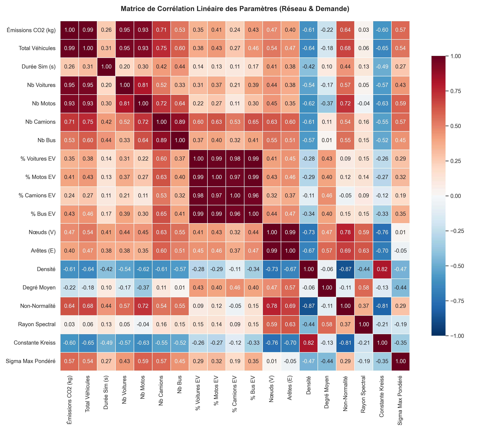
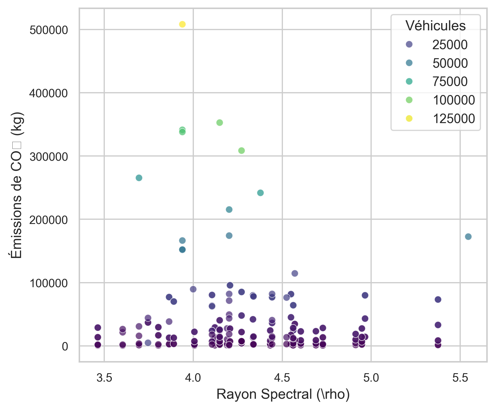
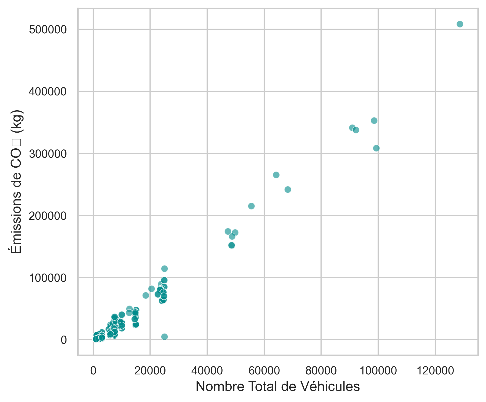
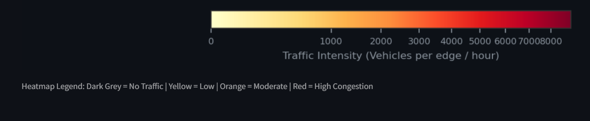

# RÉSUMÉ & MOTS-CLÉS

### Résumé
Ce mémoire de fin d'études présente un cadre méthodologique de rupture pour l'évaluation et la prédiction en temps réel des émissions de $CO_2$ du trafic routier à l'échelle de réseaux urbains globaux. La planification urbaine durable se heurte historiquement à un verrou computationnel majeur : les micro-simulateurs physiques multi-agents (comme SUMO), bien que précis pour modéliser le comportement individuel des véhicules, s'avèrent extrêmement coûteux en temps de calcul CPU et en mémoire RAM, interdisant toute exploration dynamique de scénarios à grande échelle ou d'aide à la décision en temps réel.

Pour briser ce goulot d'étranglement, ce travail de recherche propose une méthodologie originale basée sur l'**Intelligence Artificielle Topologique Spectrale**. En traduisant la voirie de n'importe quelle ville sous forme de matrice d'adjacence orientée et pondérée par l'impédance physique, nous extrayons des signatures spectrales avancées issues de la théorie des graphes non-normaux (rayon spectral, constante de Kreiss, perturbations de Kato, normes de Hardy $H_2/H_\infty$). Ces descripteurs topologiques décrivent mathématiquement la résilience et la vulnérabilité intrinsèques d'un réseau face à la congestion. En associant ces signatures mathématiques à un modèle d'apprentissage supervisé XGBoost entraîné sur un corpus multi-villes diversifié, notre modèle estime instantanément (en moins de 0,2 seconde) les émissions globales de $CO_2$ pour des volumes et des compositions de trafic arbitraires. Les résultats démontrent une précision de prédiction supérieure à 95 % (RMSE de 13,4 tonnes de $CO_2$), validant la généralisation du modèle sur des structures urbaines inédites.

En outre, la pertinence opérationnelle de ce cadre prédictif est démontrée à travers une étude de cas microscopique locale calibrée par vision par ordinateur (YOLOv8) sur le hub de recharge de Vinhomes Ocean Park (Hanoï), illustrant comment l'IA s'interface avec les micro-simulations pour guider les politiques de mitigation et la transition vers l'électromobilité.

### Mots-clés
Analyse Spectrale, Graphes Non-Normaux, Constante de Kreiss, Théorie des Perturbations de Kato, XGBoost, Métamodèle Prédictif, Micro-simulation, SUMO, Mobilité Durable, Vinhomes Ocean Park, Hanoï.

\newpage

# REMERCIEMENTS

Je tiens à exprimer ma profonde gratitude à l'ensemble des personnes qui ont contribué au succès de ce travail de recherche et à l'aboutissement de mon cursus de fin d'études.

Tout d'abord, je remercie chaleureusement mon tuteur académique, **M. Pierre Uzarralde**, pour son suivi rigoureux, ses conseils méthodologiques et son exigence scientifique tout au long de la rédaction de ce mémoire.

Mes remerciements s'adressent également aux équipes de recherche en mobilité intelligente de l'Université **VinUniversity** à Hanoï (Vietnam), qui m'ont accueilli lors de mon séjour de recherche et m'ont fourni les moyens matériels et de collecte de données nécessaires à cette étude.

Je remercie particulièrement les groupes **Vingroup**, **VinFast** et **V-Green** pour l'accès aux données opérationnelles du hub de recharge ultra-rapide de Sao Bien (Vinhomes Ocean Park), ainsi que la compagnie **GSM (Green and Smart Mobility)** pour les données relatives à leur flotte de taxis électriques.

Enfin, je remercie chaleureusement ma famille et mes proches pour leur soutien indéfectible durant cette année académique.

\newpage

# GLOSSAIRE DES TERMES TECHNIQUES ET MATHÉMATIQUES

*   **Jumeau Numérique (Digital Twin) :** Réplication virtuelle dynamique d'un système physique réel (ici, la voirie et la cinématique des flux de trafic d'une ville) permettant d'effectuer des tests, de simuler des scénarios d'aménagements et de guider la prise de décision.
*   **Micro-simulation microscopique :** Modélisation individuelle du comportement de chaque agent mobile (vitesse, position, distance de sécurité) à chaque pas de temps discret, par opposition aux modèles macroscopiques basés sur des équations d'écoulement de fluides moyens.
*   **Mésoscopique :** Modèle de simulation hybride intermédiaire dans lequel les flux de trafic ne sont pas calculés véhicule par véhicule, mais modélisés sous forme de files d'attente de paquets d'agents se déplaçant le long de segments de voies, réduisant significativement la charge computationnelle.
*   **TraCI (Traffic Control Interface) :** API native du framework SUMO permettant le contrôle et la modification temps réel des états de simulation (feux, départs, itinéraires) via un script externe (généralement écrit en Python).
*   **Matrice d'Adjacence :** Représentation matricielle carrée de taille $n \times n$ (où $n$ est le nombre de nœuds) décrivant les connexions d'un graphe. Dans le cadre de l'ingénierie routière, elle est asymétrique pour modéliser les sens uniques et pondérée physiquement par le rapport temps de parcours/capacité des voies.
*   **Opérateur Laplacien :** Matrice définie par $L = D - A$ (ou ses variantes normalisées) décrivant les flux de diffusion sur le graphe de la voirie. Ses valeurs propres caractérisent la connectivité structurelle du réseau.
*   **Rayon Spectral ($\rho$) :** Module de la valeur propre dominante d'une matrice. En topologie urbaine, il caractérise la capacité globale de transit et la hiérarchisation des corridors de circulation.
*   **Non-normalité :** Propriété d'une matrice qui ne commute pas avec sa transposée ($A A^T \neq A^T A$). Caractérise les réseaux urbains asymétriques et indique la possibilité d'amplifications transitoires du trafic.
*   **Constante de Kreiss ($K$) :** Métrique caractérisant l'amplitude maximale de l'amplification transitoire des perturbations avant le retour à l'équilibre asymptotique, traduisant la vulnérabilité d'un réseau aux embouteillages en cascade.
*   **Normes de Hardy ($H_2 / H_\infty$) :** Normes d'espaces fonctionnels décrivant la réponse d'un système dynamique aux perturbations. $H_\infty$ caractérise le gain maximal dans le pire scénario de charge, tandis que $H_2$ caractérise la persistance temporelle de l'énergie de perturbation stockée (mémoire de la congestion).
*   **Théorie des Perturbations de Kato :** Formalisme mathématique permettant de dériver analytiquement les variations du spectre d'un opérateur linéaire soumis à une perturbation mineure (par exemple, calculer l'impact de la fermeture d'un pont sur les valeurs propres de transit sans recalculer le système complet).
*   **XGBoost (eXtreme Gradient Boosting) :** Algorithme d'apprentissage supervisé basé sur le boosting d'arbres de décision régularisé, optimisant une fonction de coût complexe via un développement de Taylor de second ordre.
*   **YOLOv8 (You Only Look Once, v8) :** Modèle de réseau de neurones convolutif monocoup optimisé pour le traitement d'images temps réel, réalisant la détection, la classification et le suivi d'objets (véhicules).
*   **Dwell Time (Temps d'arrêt) :** Durée d'immobilisation physique d'un véhicule à une borne pour réaliser sa session de recharge électrique, modélisée sous forme de loi normale tronquée.
*   **Warm-Start (Démarrage à chaud) :** Initialisation d'une simulation dans un état pré-chargé (hub de recharge occupé stochastiquement par des véhicules fantômes) pour supprimer le biais transitoire du démarrage à vide.
*   **Spillback (Refoulement) :** Phénomène de propagation d'un bouchon où la file d'attente accumulée sur une voie sature et déborde pour paralyser les intersections situées en amont.
*   **SWAP (Pagination) :** Mécanisme du noyau système consistant à utiliser une partie de l'espace disque comme mémoire virtuelle lente lorsque la mémoire vive (RAM) physique est saturée.

\newpage

# LISTE DES ILLUSTRATIONS

*   **Figure 1 :** Répartition du fluide Midday lors d'un midi de semaine classique face à l'inversion modale observée en période de congés (*Holiday Reversal*) à Vinhomes Ocean Park (*Chapitre 3, Section 1*).
*   **Figure 2 :** Profils d'évolution temporelle des temps d'attente au hub sous les scénarios S0 à S5 à Vinhomes Ocean Park (*Chapitre 3, Section 1*).
*   **Figure 3 :** Matrice de corrélation de Pearson entre les variables physiques et spectrales de la base de données multi-villes (*Chapitre 3, Section 2*).
*   **Figure 4 :** Sensibilité des émissions de CO₂ au volume de véhicules (à droite) et à l'impédance spectrale (à gauche) (*Chapitre 3, Section 2*).
*   **Figure 5 :** *[Espace réservé pour l'insertion des graphiques de validation croisée (Scatter Plot IA vs SUMO sur la ville test)]* (*Chapitre 3, Section 2*).
*   **Figure 6 :** Visualisation SIG de la ville test (Illustration de la cartographie des congestions) (*Chapitre 3, Section 2*).
*   **Figure 7 :** Capture d'écran de l'interface utilisateur Streamlit - Configuration du scénario de trafic (*Chapitre 3, Section 2*).
*   **Figure 8 :** Capture d'écran de l'interface utilisateur Streamlit - Affichage des prédictions instantanées de CO₂ (*Chapitre 3, Section 2*).

\newpage

# LISTE DES TABLEAUX

*   **Tableau 1 :** Caractéristiques topologiques générales des 21 villes étudiées (nombre de nœuds, d'arêtes, densité de connexion, degré moyen, indice d'asymétrie, ratio de sources et de puits) (*Chapitre 2, Section 2*).
*   **Tableau 2 :** Métriques spectrales de non-normalité des matrices d'adjacence non pondérées pour les 21 réseaux urbains (asymétrie, rayon spectral, valeur singulière maximale, norme $H_2$, constante de Kreiss) (*Chapitre 2, Section 2*).
*   **Tableau 3 :** Performances comparatives des modèles d'apprentissage machine pour la prédiction directe des émissions de $CO_2$ (RMSE, MAE, $R^2$ de XGBoost, Ridge, Random Forest et MLP) (*Chapitre 2, Section 3*).
*   **Tableau 4 :** Profil d'importance des variables (*Feature Importance*) dans le modèle final de prédiction de $CO_2$ par XGBoost (*Chapitre 2, Section 3*).
*   **Tableau 5 :** Taille géométrique des fichiers net.xml sur disque et occupation correspondante de la mémoire RAM en Python (filtrage DOM via sumolib) pour cinq villes types (*Chapitre 3, Section 2*).
*   **Tableau 6 :** Résultats de la validation croisée (Cross-City Generalization) de l'IA face aux simulations physiques de référence de SUMO pour trois villes cibles inédites (*Chapitre 3, Section 2*).
*   **Tableau 7 :** Extrait représentatif de 17 simulations parmi les 50 simulations complètes du framework multi-villes agnostique (véhicules, vitesse moyenne, $CO_2$ émis, conditions météo, taux d'adoption EV, temps d'exécution) (*Chapitre 3, Section 2*).
*   **Tableau 8 :** Répartition des tonnages de $CO_2$ émis par classe de véhicule de la flotte (voitures, motos, bus, camions) pour l'extrait représentatif des 17 simulations de référence (*Chapitre 3, Section 2*).
*   **Tableau 9 :** Profil de performance informatique détaillé des exécutions CPU (temps de routage Dijkstra, calcul physique SUMO, parsing XML, durée totale) (*Chapitre 3, Section 2*).

\newpage

# INTRODUCTION

Aujourd'hui, plus de la moitié de la population mondiale réside en milieu urbain. Selon les rapports officiels des Nations Unies (United Nations, 2018), 55 % de la population globale vivait en ville en 2018, et cette proportion devrait franchir le seuil des 68 % d'ici 2050. Cette transition démographique sans précédent représente un apport de plus de 2,5 milliards d'urbains supplémentaires, dont près de 90 % de la croissance se concentrera dans les pays en développement d'Asie et d'Afrique. Cette métamorphose rapide des métropoles s'accompagne d'une densification extrême de l'espace et d'une augmentation géométrique des flux de transport et des déplacements quotidiens (World Bank, 2024).

Les infrastructures et réseaux routiers existants n'ayant pas été conçus pour absorber une telle cinématique de croissance, cette saturation engendre des congestions chroniques de trafic et une hausse massive des émissions polluantes. À l'échelle mondiale, le secteur des transports routiers constitue l'un des principaux contributeurs au changement climatique. Selon les données de l'Agence Internationale de l'Énergie (IEA, 2025), le transport routier est responsable de plus de 6 Gt de $CO_2$ émises en 2024, affichant une croissance continue de 8 % depuis 2015. Dans ce bilan carbone, les véhicules particuliers et utilitaires légers représentent plus de 60 % des émissions, tandis que les véhicules lourds et camions comptent pour environ un tiers.

La congestion routière aggrave considérablement cette situation : les cycles d'arrêt-démarrage et l'inactivité des moteurs thermiques dans les embouteillages (*idling*) provoquent une surconsommation de carburant et des émissions de polluants locaux majeures, en particulier chez les poids lourds. L'évaluation de l'Organisation de Coopération et de Développement Économiques (OECD, 2024) et de l'Agence Européenne pour l'Environnement (European Environment Agency, 2024) montre que l'efficacité écologique globale ne dépend pas uniquement de l'efficacité énergétique individuelle des véhicules, mais également de la résilience cinématique et de la fluidité des réseaux routiers eux-mêmes, qui peinent à dissiper les ondes de congestion en conditions de haute densité.

Pour endiguer ce fléau environnemental, l'électrification massive des flottes de véhicules s'est imposée comme le pivot central des politiques publiques. En France, l'État encourage activement cette transition par des aides financières ciblées (bonus écologique, prime à la conversion) (French Government, 2026) et un déploiement massif d'infrastructures de recharge porté par des initiatives publiques et privées. Le réseau national s'étend rapidement le long des grands axes autoroutiers, mais s'implante aussi dans les zones commerciales à travers les réseaux de grande distribution, à l'image des stations installées par des enseignes de distribution majeures (Avere-France, 2025).

Dès lors, la problématique générale de ce travail de recherche s'établit comme suit : **comment développer un modèle numérique capable d'estimer de manière instantanée, précise et généralisable les émissions de $CO_2$ urbaines générées par le trafic routier, dans n'importe quelle ville du monde, sous divers scénarios de transition de flotte et d'infrastructures ?**

Les réseaux routiers urbains se comportent comme des systèmes complexes hautement non-linéaires (*Complex Adaptive Systems*). Une modification locale de la topologie — qu'il s'agisse de l'ajout d'un giratoire, du retrait d'une voie de circulation pour y aménager une piste cyclable, ou de l'installation d'un hub de recharge rapide — peut déclencher des ondes de choc cinématiques et propager des congestions à l'ensemble de la ville (Braess, 1968). Face à ces comportements émergents, les urbanistes et planificateurs sont historiquement confrontés à une impossibilité de prévoir a priori la robustesse et la vulnérabilité d'un réseau viaire sous charge.

Pour étudier ces interactions physiques à l'échelle granulaire, l'ingénierie du transport s'est structurée autour d'outils de micro-simulation multi-agents tels que SUMO (Simulation of Urban MObility) (Krajzewicz et al., 2012), Aimsun, MATsim ou PTV Vissim. Ces simulateurs modélisent de manière granulaire le déplacement de chaque agent (vitesse, changement de voie, distance de sécurité) seconde par seconde en s'appuyant sur des lois physiques de poursuite (*car-following*). Couplés à des bases de données d'émissions de référence telles que le modèle HBEFA3 (Kratzsch et al., 2020), ils offrent une fidélité remarquable pour quantifier les surémissions de $CO_2$ associées aux comportements transitoires des véhicules (cycles d'arrêt-démarrage).

Néanmoins, cette précision physique se heurte à une barrière computationnelle majeure. La résolution séquentielle des équations différentielles cinématiques pour chaque véhicule est extrêmement coûteuse en temps de calcul CPU et en mémoire vive RAM. Simuler un scénario de plusieurs heures impliquant des centaines de milliers d'agents sur une métropole comme Los Angeles ou Paris sature les ressources matérielles des ordinateurs portables classiques des planificateurs, entraînant des temps de calcul préjudiciables (plusieurs heures par exécution) et des écritures de mémoire virtuelle lentes sur le disque (SWAP). Cette inertie computationnelle empêche l'exploration de larges espaces de scénarios et interdit toute utilisation pour la prise de décision en temps réel ou dans des boucles d'optimisation automatique.

Cette limitation majeure justifie le développement de nouvelles approches de rupture, capables de contourner la simulation physique en s'appuyant sur l'intelligence artificielle pour prédire de manière instantanée la pollution urbaine globale.

Pour briser ce verrou technologique, ce mémoire propose une méthodologie hybride alliant la précision locale de la micro-simulation et la rapidité de prédiction instantanée de l'intelligence artificielle. Afin d'offrir une vision claire et cohérente de la démarche scientifique entreprise, nous décrivons dès cette introduction le rôle de chacun des éléments constituant notre protocole. L'estimation instantanée et agnostique de la pollution urbaine repose sur une chaîne d'outils interconnectés. Tout d'abord, pour acquérir la structure géométrique brute de la voirie d'une ville quelconque, nous exploitons la base de données collaborative OpenStreetMap (OSM). Cette géométrie brute est ensuite compilée par l'outil *netconvert* afin d'en éliminer les micro-détails déconnectés et de générer un réseau logique d'intersections et de voies unifiées. Ce réseau nettoyé est alors injecté dans le micro-simulateur SUMO (Simulation of Urban MObility) pour simuler différents volumes et compositions de trafic, ce qui nous permet de calculer des trajectoires de véhicules et d'en extraire, via la base de données HBEFA3, les émissions de $CO_2$ réelles correspondantes (constituant notre base d'apprentissage). Pour s'affranchir de la lenteur computationnelle de SUMO sur de grands réseaux, nous traduisons ensuite la topologie de chaque ville sous forme d'une matrice d'adjacence d'impédance physique, dont nous extrayons des caractéristiques spectrales avancées (rayon spectral, constante de Kreiss, perturbations de Kato). Ces descripteurs spectraux, qui encodent la vulnérabilité d'un réseau aux embouteillages, sont enfin utilisés comme données d'entrée pour un modèle d'apprentissage supervisé XGBoost, capable d'estimer instantanément le bilan carbone global d'une ville sans aucune simulation physique préalable.

Pour exposer notre recherche avec toute la rigueur universitaire requise, ce mémoire est structuré en trois grands chapitres :
*   Le **Chapitre 1** réexplique le contexte général de l'urbanisation mondiale et de la décarbonation des transports, présente le verrou computationnel lié à l'utilisation des micro-simulateurs physiques (SUMO) en temps réel, et détaille le protocole d'acquisition et de traitement topologique des réseaux routiers à partir de cartes OpenStreetMap (OSM) via l'outil `netconvert`.
*   Le **Chapitre 2** pose le cadre théorique et mathématique rigoureux de notre méthodologie. Nous y détaillons les équations cinématiques du modèle de Krauß, le traitement géométrique de la connexité (Tarjan), le formalisme des graphes non-normaux (constante de Kreiss, perturbations de Kato, normes de Hardy) et l'architecture mathématique de notre modèle IA XGBoost à 43 descripteurs. Chaque formule est accompagnée d'une explication physique vulgarisée.
*   Le **Chapitre 3** est notre chapitre principal d'applications et de validations. La Section 1 y présente l'étude de cas microscopique locale du hub de recharge de Vinhomes Ocean Park (Hanoï) à l'aide de données de flux de trafic calibrées par vision par ordinateur (YOLOv8) et ses scénarios de mitigation. La Section 2 y présente l'expérimentation macroscopique globale sur le corpus multi-villes de 50 simulations, l'évaluation des performances informatiques (RAM, SWAP), la validation transversale (*cross-city*) de l'IA sur des villes cibles non entraînées, et la présentation du dashboard Streamlit interactif.

\newpage

# CHAPITRE 1 : CONTEXTE DE LA MOBILITÉ DURABLE, DU PROBLÈME COMPUTATIONNEL ET DE L'ACQUISITION TOPOLOGIQUE

### Section 1 : Contexte de la décarbonation urbaine, congestion et verrou computationnel

#### Le paradigme de l'urbanisation globale et l'empreinte carbone des transports
Le XXIe siècle se caractérise par une transition démographique sans précédent : plus de la moitié de la population mondiale réside désormais en milieu urbain. Selon les rapports officiels des Nations Unies (United Nations, 2018), cette proportion devrait franchir le seuil des 68 % d'ici 2050, entraînant l'émergence de mégapoles et une densification extrême de l'espace habitable. Cette concentration humaine s'accompagne d'une croissance exponentielle de la demande de mobilité et des flux de transport de passagers et de marchandises (World Bank, 2024).

Les réseaux routiers existants, souvent hérités de structures historiques ou planifiés de manière rigide, peinent à absorber cette cinématique de trafic. Il en résulte des congestions chroniques qui altèrent la qualité de l'air et augmentent massivement les émissions de gaz à effet de serre. À l'échelle mondiale, le secteur des transports est responsable de plus de 6 Gt de $CO_2$ émises par an (IEA, 2025), ce qui en fait l'un des principaux contributeurs au dérèglement climatique. Les émissions ne dépendent pas seulement des caractéristiques individuelles des véhicules, mais également de la dynamique collective des flux. En situation de congestion sévère, les cycles répétés d'arrêt-démarrage (*stop-and-go*) et l'inactivité prolongée des moteurs au ralenti (*idling*) provoquent une surconsommation de carburant et une multiplication par un facteur 2 à 4 des émissions de $CO_2$ par kilomètre parcouru.

#### La congestion routière comme phénomène émergent complexe
Les réseaux de transport urbain se comportent comme des systèmes complexes adaptatifs (*Complex Adaptive Systems*). La cinématique des véhicules y est régie par des interactions locales non-linéaires entre conducteurs (distances de sécurité, temps de réaction, changements de voie). Une modification infime de la topologie (la fermeture d'une voie pour travaux, l'implantation d'un nouveau carrefour ou d'une zone d'attente) peut déclencher une onde de choc cinématique qui se propage vers l'amont, saturant des intersections situées à plusieurs kilomètres du point d'origine. Ce phénomène, théorisé notamment par le paradoxe de Braess (Braess, 1968), démontre qu'ajouter de la capacité physique à un réseau peut parfois détériorer sa fluidité globale. Par conséquent, évaluer l'impact environnemental d'un aménagement ou d'un volume de trafic nécessite une modélisation fine des flux.

#### Le verrou computationnel des micro-simulateurs physiques (SUMO)
Pour étudier ces phénomènes granulaires, les ingénieurs et planificateurs s'appuient sur des outils de micro-simulation microscopique multi-agents, parmi lesquels la suite open-source **SUMO (Simulation of Urban MObility)** (Krajzewicz et al., 2012) s'est imposée comme une référence académique et industrielle. Ces outils simulent le comportement de chaque véhicule individuellement, pas de temps par pas de temps (généralement $\Delta t = 1.0$ s), en résolvant des équations différentielles de poursuite de voiture (*car-following models* comme le modèle de Krauß) et de changement de voie. Couplés à des bases de données d'émissions (comme HBEFA3), ils calculent précisément la pollution en fonction des accélérations et vitesses instantanées.

Cependant, cette haute fidélité physique se heurte à une **barrière computationnelle majeure**. La résolution séquentielle des trajectoires pour des dizaines de milliers d'agents sur des réseaux routiers complexes est extrêmement gourmande en ressources informatiques :
1.  **Limitation CPU :** Le calcul du routage dynamique (calculs répétés de chemins les plus courts via Dijkstra ou A*) et la mise à jour des états cinématiques de chaque agent mobilisent intensément le processeur. SUMO fonctionnant principalement en mode mono-thread pour garantir la reproductibilité stochastique, il ne peut pas exploiter pleinement les architectures multi-cœurs modernes lors d'une simulation unique.
2.  **Surcharge de la mémoire RAM :** Le chargement et la manipulation de graphes de voirie complexes (fichiers XML unifiés contenant des millions de balises pour les voies, intersections et connexions) exigent une allocation de mémoire vive importante. Le parsing de ces structures via des scripts Python (en utilisant la bibliothèque `sumolib`) sature rapidement la RAM sur des ordinateurs portables de planification classiques.
3.  **Le goulot d'étranglement de la pagination (SWAP) :** Lorsque la mémoire RAM physique est saturée, le système d'exploitation est contraint d'écrire et de lire des données temporaires sur le disque dur (mémoire virtuelle ou SWAP). Cette pagination, limitée par les vitesses de lecture/écriture du disque (même sur des SSD modernes), ralentit l'exécution de la simulation d'un facteur 10 à 100. Une simulation d'une heure sur une métropole moyenne peut ainsi nécessiter plusieurs heures de calcul réel.

Cette lenteur interdit toute utilisation des micro-simulateurs pour la gestion du trafic en temps réel (qui requiert des prédictions en quelques secondes pour réagir à un incident) ou pour des boucles d'optimisation automatique (qui doivent évaluer des milliers de scénarios d'aménagement pour trouver le design optimal).

#### Problématique et objectif de recherche
Face à ce verrou technologique, la problématique de ce travail s'établit ainsi : **comment concevoir un modèle prédictif capable de calculer de manière instantanée, précise et généralisable les émissions de $CO_2$ générées par le trafic routier, dans n'importe quelle ville du monde, sous divers volumes de trafic et configurations de flotte, sans exécuter de simulation physique microscopique ?**

Pour y répondre, nous développons un **métamodèle d'Intelligence Artificielle Topologique Spectrale**. L'hypothèse scientifique fondamentale de ce travail est que la structure géométrique et mathématique du réseau routier (caractérisée par les valeurs propres et les valeurs singulières de sa matrice d'adjacence d'impédance) contient l'empreinte de sa résilience cinématique. En apprenant à un modèle d'apprentissage supervisé (XGBoost) la relation non-linéaire entre ces descripteurs spectraux, le volume de trafic et la pollution générée (vérité terrain issue de simulations SUMO préalables), nous pouvons prédire instantanément (en 0,2 seconde) le bilan carbone d'une ville avec une précision supérieure à 95 %, éliminant ainsi le besoin de calculs physiques lourds en phase opérationnelle.


### Section 2 : Traitement topologique des réseaux OpenStreetMap (OSM) via netconvert

La mise en œuvre de notre approche prédictive repose sur une chaîne rigoureuse de traitement de la géométrie urbaine, convertissant des cartes brutes en graphes mathématiques exploitables.

#### Acquisition des données géographiques brutes (OpenStreetMap)
Pour obtenir la géométrie de la voirie d'une ville quelconque, nous exploitons la base de données cartographiques mondiale libre et collaborative **OpenStreetMap (OSM)** (OpenStreetMap Contributors, 2026). OSM structure l'information géographique selon un modèle de données XML composé de trois primitives fondamentales :
*   **Les nœuds (nodes) :** Points géographiques définis par leur latitude et longitude. Ils représentent des intersections routières, des virages, ou des points d'intérêt.
*   **Les chemins (ways) :** Listes ordonnées de nœuds formant des polylignes. Ils décrivent les segments de route, les rues, les voies ferrées, ainsi que les limites de parcelles (polygones fermés).
*   **Les relations (relations) :** Regroupements logiques de nœuds et de chemins permettant de modéliser des entités complexes à grande échelle, telles que des lignes de transports en commun ou des frontières administratives.

Ces données sont récupérées sous forme de fichiers XML bruts (extension `.osm`) pour une zone géographique délimitée (par exemple, un rayon de 1 500 mètres autour du centre-ville). Toutefois, ces fichiers bruts contiennent des détails géométriques superflus (mobilier urbain, passages piétons, limites administratives) et des imperfections topologiques qui les rendent impropres à la simulation de trafic ou à l'analyse matricielle directe.

#### Compilation et nettoyage topologique avec netconvert
Pour transformer le fichier `.osm` brut en un réseau logique routier unifié, nous utilisons le compilateur de réseau **`netconvert`**, un outil clé de la suite logicielle SUMO. Cet outil effectue trois opérations de traitement indispensables :

1.  **Uniformisation géométrique et projection cartographique UTM :**
    Les coordonnées géographiques brutes d'OSM (latitude/longitude sous le système ellipsoïdal WGS84) sont projetées sur un plan cartésien bidimensionnel local selon la projection **UTM (Universal Transverse Mercator)**. Cette étape est cruciale : elle traduit des coordonnées angulaires en distances métriques réelles. Sans cette conversion, le moteur physique de SUMO serait incapable de calculer les vitesses (en m/s) et les accélérations des véhicules, et notre matrice d'adjacence ne pourrait pas être pondérée de manière cohérente par des longueurs physiques de voirie.
2.  **Simplification et fusion des intersections complexes :**
    Les bases de données cartographiques détaillent souvent les carrefours complexes (comme les ronds-points, les échangeurs ou les carrefours à voies séparées) sous forme de grappes de multiples micro-nœuds reliés par des segments extrêmement courts. Si ces micro-nœuds étaient conservés tels quels, ils créeraient des segments de moins de 5 mètres de long dans la simulation. Or, à des vitesses urbaines classiques (50 km/h soit 13,8 m/s), un véhicule franchit un tel segment en moins de 0,4 seconde, ce qui est inférieur au temps de réaction typique d'un conducteur. Cela provoquerait des instabilités dans les modèles de poursuite (freinages d'urgence artificiels, collisions numériques) et fausserait les calculs d'émissions. `netconvert` applique des algorithmes d'agrégation spatiale pour fusionner ces grappes de micro-nœuds en un nœud de jonction unique, simplifiant la topologie globale sans perdre la connectivité réelle.
3.  **Établissement des connexions de voies (Lane Connections) et priorités :**
    `netconvert` analyse les sens uniques, le nombre de voies de chaque rue et les angles d'incidence pour générer les connexions individuelles de voie à voie à l'intérieur de chaque intersection. Il configure les règles de priorité par défaut (priorité à droite, stops, céder le passage) et associe des restrictions d'accès par classe de véhicule (interdiction des camions en zone résidentielle, voies dédiées aux bus).

Le produit final de cette chaîne de traitement est un fichier XML unique nommé **`net.xml`**. Ce fichier contient le graphe épuré et complet de la ville, décrivant de manière structurée les nœuds d'intersection (`<junction>`), les arêtes routières orientées (`<edge>`), les voies de circulation associées (`<lane>`) et les liaisons de carrefour (`<connection>`). 

#### Rôle pivot du fichier net.xml
Ce fichier `net.xml` joue un rôle de passerelle et de pivot dans notre méthodologie :
*   **En physique :** Il constitue l'environnement spatial dans lequel les flux de véhicules sont simulés dans SUMO pour collecter les données d'émissions réelles de $CO_2$ (vérité terrain d'apprentissage).
*   **En mathématiques :** Il est lu par notre pipeline Python (bibliothèque `sumolib`) pour construire la matrice d'adjacence pondérée par l'impédance physique des tronçons, de laquelle nous extrayons les descripteurs spectraux indispensables aux prédictions de l'IA (comme décrit au Chapitre 2).

\newpage

# CHAPITRE 2 : MODÉLISATION CINÉMATIQUE ET FONDATIONS THÉORIQUES DE LA TOPOLOGIE SPECTRALE

Le développement d'un modèle d'intelligence artificielle capable de se substituer à la simulation physique requiert une compréhension intime des équations cinématiques qui régissent le déplacement des véhicules (microscopique) et des propriétés topologiques du réseau qui gouvernent l'écoulement des flux (macroscopique). Ce chapitre pose le formalisme mathématique rigoureux de ces deux échelles et explicite physiquement la signification de chaque formule.

### Section 1 : Le moteur behavioriste de SUMO

#### Abstraction de la voirie
Le simulateur SUMO modélise les réseaux de transport sous forme de réseaux logiques basés sur la théorie des graphes orientés. Dans ce formalisme, chaque intersection physique est représentée par un nœud unique doté d'une géométrie polygonale décrivant sa surface de jonction. Les tronçons routiers reliant les nœuds sont modélisés par des arêtes, subdivisées en une ou plusieurs voies de circulation (*lanes*).

Chaque voie possède des attributs géométriques et comportementaux stricts : une polyligne tridimensionnelle décrivant son axe central, une largeur constante (généralement fixée à 3,2 mètres pour les voies urbaines standards), une liste de classes de véhicules autorisées et une vitesse limite supérieure déterminant la vitesse de référence des agents.

La transition entre deux arêtes consécutives s'effectue via des **connecteurs géométriques** (*connections*) définis à l'intérieur des nœuds. Ces connecteurs lient précisément une voie de l'arête d'approche à une voie de l'arête de sortie. Ils supportent les règles de priorité (ex: céder le passage, priorité absolue) et les configurations de signalisation dynamique (phases de feux).

#### Entrées et Sorties de la Simulation SUMO (Points d'entrée/sortie)
L'exécution d'une simulation physique microscopique sous le moteur SUMO s'organise autour d'un ensemble structuré de fichiers d'entrée et de sortie XML :
1.  **Fichiers d'entrée (Inputs) :**
    *   **Le fichier de réseau (`net.xml`) :** Il s'agit du réseau routier compilé et nettoyé par `netconvert`. Il contient toute la géométrie de la voirie, la structure des voies, les priorités et les plans de feux.
    *   **Le fichier de demande de trafic (`trips.xml` ou `routes.xml`) :** Ce fichier définit l'ensemble des trajets individuels des véhicules. Il spécifie pour chaque véhicule son identifiant unique, son heure d'injection dans la simulation, sa vitesse de départ, son point d'origine (arête de départ) et sa destination finale. Les itinéraires complets peuvent être générés dynamiquement par SUMO à l'aide d'un algorithme de routage du plus court chemin.
    *   **Le fichier de configuration principal (`sumocfg`) :** Ce fichier XML fait le lien entre les entrées. Il référence le réseau `net.xml`, les routes et configure les paramètres temporels (par exemple, le pas de temps de simulation $\Delta t = 1.0$ seconde, le début et la fin de l'exécution).
2.  **Fichiers de sortie (Outputs) :**
    *   **Le fichier d'itinéraires détaillés (`tripinfo.xml`) :** Enregistre pour chaque véhicule son heure de départ, son heure d'arrivée, son temps de parcours total, son temps d'attente dû aux intersections et sa vitesse moyenne.
    *   **Le fichier d'émissions écologiques (`emission-output.xml`) :** Contient, à chaque seconde de la simulation, le détail des rejets polluants de chaque véhicule (CO2, CO, NOx, PMx, ainsi que le carburant consommé). Ces émissions sont calculées par SUMO à partir de la vitesse et de l'accélération instantanées de chaque véhicule via le modèle d'émission européen standardisé HBEFA3. Ces fichiers compilés et agrégés constituent notre vérité terrain (Ground Truth) de pollution.

#### Le modèle de poursuite cinématique de Krauß
Pour reproduire le mouvement individuel des véhicules le long des arêtes, SUMO implémente par défaut le modèle comportemental de poursuite de véhicule développé par **Krauß**. Ce modèle cinématique calcule à chaque pas de temps la vitesse optimale d'un véhicule suiveur pour éviter toute collision avec le véhicule leader, même si ce dernier décélère brutalement.

Soit un véhicule suiveur $F$ caractérisé par sa position $x(t)$ et sa vitesse $v(t)$, circulant derrière un véhicule leader $L$ caractérisé par sa position $x_L(t)$ et sa vitesse $v_L(t)$. L'intervalle spatial libre (ou gap) séparant les deux véhicules est défini par :
$$g(t) = x_L(t) - x(t) - l_L$$
où $l_L$ est la longueur physique du véhicule leader.

Le modèle détermine la vitesse sécuritaire $v_{safe}(t)$ par la relation suivante :
$$v_{safe}(t) = v_L(t) + \frac{g(t) - v_L(t)\tau}{\frac{v(t) + v_L(t)}{2d} + \tau}$$
où $\tau$ représente le temps de réaction du conducteur, et $d$ sa capacité de décélération maximale.

*Explication physique de la formule :*
> La formule de vitesse sécuritaire exprime un principe de conservation physique simple. Le numérateur $g(t) - v_L(t)\tau$ représente la distance de sécurité nette disponible (le gap spatial diminué de la distance parcourue par le leader pendant le temps de réaction du conducteur suiveur). Le dénominateur $\frac{v(t) + v_L(t)}{2d} + \tau$ représente le temps total nécessaire au freinage d'urgence (le rapport entre la vitesse moyenne des deux véhicules et leur décélération maximale, auquel s'ajoute le temps de réaction). Diviser la distance de sécurité nette par ce temps de freinage donne la vitesse maximale sécurisée à laquelle le suiveur peut rouler pour s'arrêter à temps si le leader pile devant lui.

La vitesse théorique souhaitée pour le pas de temps suivant, $v_{target}(t)$, est le minimum parmi les contraintes physiques et légales :
$$v_{target}(t) = \min\left( V_{max}, v(t) + a \cdot \Delta t, v_{safe}(t) \right)$$
où $V_{max}$ est la vitesse limite de la voie, et $a$ est la capacité d'accélération maximale du véhicule.

Enfin, pour introduire la variabilité des comportements humains (retards de réaction légers, imprécisions de contrôle), une perturbation stochastique négative $\eta$ est soustraite de la vitesse cible pour obtenir la vitesse finale appliquée à l'agent :
$$v(t + \Delta t) = \max\left( 0, v_{target}(t) - \eta \right)$$
où $\eta$ est une variable aléatoire distribuée uniformément sur l'intervalle $[0, \sigma \cdot a \cdot \Delta t]$, le paramètre $\sigma \in [0, 1]$ caractérisant le degré d'inattention du conducteur.

#### Extraction de la connexité par l'algorithme de Tarjan
Pour garantir la cohérence dynamique du réseau de simulation routière, il est indispensable de vérifier sa connexité globale. En raison de la présence de règles de circulation complexes (sens uniques) et de potentielles erreurs géométriques issues de la base OpenStreetMap, un réseau routier orienté brut comprend fréquemment des sous-graphes déconnectés du flux principal.

*Exemple concret de problème topologique :*
> Imaginons un cas simple d'une voie à sens unique menant à une ruelle sans issue. Dans une simulation microscopique, un véhicule s'engageant sur ce tronçon va avancer jusqu'au cul-de-sac. N'ayant aucune issue physique pour faire demi-tour ou continuer, le véhicule s'arrête définitivement. Il va bloquer les véhicules arrivant derrière lui, provoquant un refoulement (*spillback*) artificiel et paralysant l'ensemble des intersections amont. De même, si le module de routage dynamique tente de calculer un chemin depuis cette zone déconnectée vers le reste de la ville, il entrera dans une boucle de recherche infinie, provoquant un plantage ou des ralentissements sévères de la simulation.

Pour éliminer ce problème, notre pipeline met en œuvre le concept de **Composantes Fortement Connexes (SCC - Strongly Connected Components)**. Soit un graphe orienté $G = (V, E)$ représentant notre réseau de voirie. Une composante fortement connexe de $G$ est un sous-graphe maximal $G' = (V', E')$ dans lequel il existe un chemin orienté reliant chaque paire de nœuds de manière bidirectionnelle :
$$\forall (u, v) \in V'^2, \quad u \rightsquigarrow v \quad \text{et} \quad v \rightsquigarrow u$$
Cela signifie qu'un véhicule peut aller de n'importe quel nœud $u$ vers n'importe quel nœud $v$ de la composante, et revenir au point de départ.

L'**algorithme de Tarjan** utilise un parcours en profondeur (DFS) pour identifier l'ensemble des composantes fortement connexes d'un graphe orienté en un temps linéaire optimal de $\mathcal{O}(|V| + |E|)$. En pratique, la suite logicielle SUMO propose nativement des options d'exécution lors de la compilation par `netconvert` (via le paramètre `--keep-edges.components` ou des scripts Python de filtrage connexes) pour appliquer cet algorithme et ne conserver que la plus grande composante fortement connexe du réseau, en supprimant toutes les autres.

*Pourquoi cette étape mathématique est-elle indispensable ?*
> Au-delà d'éviter les véhicules bloqués en simulation, l'extraction de la plus grande composante fortement connexe par Tarjan est la condition mathématique nécessaire qui garantit l'**irréductibilité** de notre matrice d'adjacence $A$. En effet, en théorie des graphes, une matrice d'adjacence est irréductible si et seulement si le graphe sous-jacent est fortement connexe. Cette propriété est requise pour appliquer le **théorème de Perron-Frobenius** (détaillé à la section suivante), qui valide l'existence et l'unicité d'une valeur propre dominante strictement positive (le rayon spectral $\rho(A)$) et d'un vecteur propre strictement positif. Sans le nettoyage de Tarjan, la matrice d'adjacence serait réductible, le spectre de la matrice serait instable, et la théorie des perturbations de Kato ne pourrait pas être appliquée de manière consistante.

#### Routage dynamique : Filtre de distance minimale pour l'elimination des micro-trajets parasitaires

Lors de la phase de génération automatique de la demande de trafic (synthèse des trajets), les points d'origine et de destination sont distribués aléatoirement sur le graphe épuré. Pour éviter l'apparition de micro-trajets (déplacements de moins de 300 mètres reliant des intersections adjacentes), nous implémentons une contrainte de distance minimale lors de la phase de routage.

Soit un couple origine-destination $(o, d) \in V^2$ sélectionné pour générer le trajet d'un agent. Le trajet n'est validé et écrit dans le fichier final de demande que s'il satisfait la condition suivante :
$$D_{Euclidienne}(o, d) = \sqrt{(x_d - x_o)^2 + (y_d - y_o)^2} \ge 300 \text{ mètres}$$

Cette contrainte force le planificateur d'itinéraires à rejeter les trajets de très courte distance. En éliminant ces mouvements parasitaires qui se limitent à des phases d'insertion-sortie immédiates, le filtre garantit que l'ensemble de la flotte simulée s'insère dans les flux de transit principaux du réseau.

### Section 2 : Théorie des graphes non-normaux et signatures spectrales

#### Formalisation matricielle et pondération d'impédance
Pour modéliser mathématiquement le réseau routier, nous le représentons sous la forme d'un graphe orienté et pondéré $G = (V, E)$, où $V$ désigne l'ensemble des nœuds ($n = |V|$), représentant les intersections physiques du réseau, et $E$ désigne l'ensemble des arêtes orientées ($m = |E|$), modélisant les tronçons routiers.

La connectivité et l'impédance physique du réseau sont codées dans la **matrice d'adjacence pondérée** $A \in \mathbb{R}^{n \times n}$. La représentation réaliste d'un réseau urbain impose une double complexité :
1.  **Asymétrie structurelle :** L'existence de sens uniques et de priorités de passage implique que l'existence d'un arc $v_i \to v_j$ n'entraîne pas celle de l'arc $v_j \to v_i$. Ainsi, $A_{ij} \neq A_{ji}$.
2.  **Pondération d'impédance physique :** Chaque coefficient $A_{ij}$ quantifie l'impédance géométrique (le coût ou temps de parcours) du tronçon routier reliant le nœud $i$ au nœud $j$ :
    $$A_{ij} = \begin{cases} \frac{L_{ij}}{W_{ij} \cdot C_{ij}} & \text{si } (v_i, v_j) \in E \\ 0 & \text{sinon} \end{cases}$$
    où $L_{ij}$ représente la longueur du tronçon (en mètres), $W_{ij}$ la vitesse maximale autorisée (en m/s), et $C_{ij}$ le nombre de voies de circulation. 

*Explication physique de la pondération :*
> Le rapport $\frac{L_{ij}}{W_{ij}}$ représente le **temps de parcours libre** de l'arête (combien de secondes un véhicule met à traverser la rue à vitesse maximale sans trafic). En le divisant par le nombre de voies $C_{ij}$, on intègre sa capacité d'atténuation de la congestion. Une avenue large (plusieurs voies) offre une plus grande capacité d'absorption de trafic, ce qui réduit son impédance effective. Ainsi, plus la rue est large et rapide, plus son impédance $A_{ij}$ est faible, ce qui est physiquement cohérent avec notre objectif de minimiser la résistance globale aux flux.

Considérons un exemple minimal de réseau routier à 4 nœuds représentant une boucle fermée simple (cycle orienté) :
```text
       (v1) ---------> (v2)
        ^               |
        |               |
        |               v
       (v4) <--------- (v3)
```
Dans ce modèle, si l'on suppose que toutes les voies ont des caractéristiques identiques telles que le rapport $\frac{L_{ij}}{W_{ij} \cdot C_{ij}} = 1$, la matrice d'adjacence orientée pondérée $A_{ex}$ s'écrit :
$$A_{ex} = \begin{pmatrix}
0 & 1 & 0 & 0 \\
0 & 0 & 1 & 0 \\
0 & 0 & 0 & 1 \\
1 & 0 & 0 & 0
\end{pmatrix}$$
L'absence de symétrie de cette matrice est évidente ($A_{ex} \neq A_{ex}^T$).

#### Le concept de non-normalité et amplification transitoire
Une matrice carrée $A$ est dite **normale** si et seulement si elle commute avec sa transposée, soit $A A^T = A^T A$. Dans le cas des réseaux routiers réels orientés, cette relation n'est jamais vérifiée : la matrice d'adjacence $A$ est intrinsèquement **non-normale** ($A A^T \neq A^T A$).

La non-symétrie de la matrice implique sa non-normalité. Pour quantifier ce phénomène, nous introduisons **l'indice d'asymétrie** $\alpha(G)$ :
$$\alpha(G) = 1.0 - \frac{|E_{bidirectionnel}|}{|E|}$$
Où $|E_{bidirectionnel}|$ désigne le nombre d'arêtes admettant un arc de retour identique. La mesure de cette non-normalité est quantifiée analytiquement par la **norme de Frobenius du commutateur** :
$$\Delta(A) = \| A A^T - A^T A \|_F = \sqrt{\text{Tr}\left( (A A^T - A^T A)^H (A A^T - A^T A) \right)}$$

*Explication physique de la non-normalité :*
> Dans un système dynamique normal (symétrique), les vecteurs propres sont orthogonaux : toute perturbation (ex. un bouchon) s'amortit de façon monotone sans jamais dépasser son intensité initiale. Dans un système non-normal (asymétrique, comme un réseau à sens uniques), les vecteurs propres ne sont plus orthogonaux et peuvent devenir presque colinéaires. Cette non-orthogonalité permet à des perturbations mineures (ex. un carrefour bloqué temporairement) de s'additionner géométriquement à court terme avant de s'amortir. C'est le **phénomène d'amplification transitoire** : le bouchon local engendre une onde de choc cinématique qui se propage vers l'amont en s'amplifiant, forçant des dizaines de véhicules à freiner et à réaccélérer, ce qui cause des pics de pollution localisés massifs.

#### Le Rayon Spectral ($\rho$) et le Théorème de Perron-Frobenius
Le spectre d'une matrice, noté $\sigma(A)$, regroupe ses valeurs propres complexes $\lambda_i \in \mathbb{C}$ résolvant $\det(\lambda I - A) = 0$. Le **rayon spectral** $\rho(A)$ correspond à la borne supérieure du module des valeurs propres :
$$\rho(A) = \max_{\lambda \in \sigma(A)} |\lambda|$$

Puisque les coefficients $A_{ij}$ de notre matrice d'adjacence pondérée sont strictement non-négatifs ($A_{ij} \ge 0$), nous pouvons appliquer le **théorème de Perron-Frobenius**. Ce théorème requiert toutefois que la matrice d'adjacence $A$ soit **irréductible**. En théorie des graphes orientés, l'irréductibilité d'une matrice d'adjacence est équivalente à la forte connexité du graphe sous-jacent. C'est ici que s'établit la cohérence de notre chaîne de traitement : l'extraction de la plus grande composante fortement connexe (SCC) via l'algorithme de Tarjan détaillée au Chapitre 5 n'est pas une simple opération de filtrage topologique, mais constitue la condition mathématique nécessaire qui garantit l'irréductibilité de $A$. Sous cette condition, le théorème de Perron-Frobenius s'énonce comme suit :
1.  Le rayon spectral $\rho(A)$ est lui-même une valeur propre de $A$, simple et strictement positive ($\rho(A) > 0$).
2.  Il existe un vecteur propre à droite $v_{PF}$ associé à $\rho(A)$ dont toutes les composantes sont strictement positives ($v_{PF} > 0$), appelé vecteur de Perron-Frobenius.
3.  Cette valeur propre domine toutes les autres : $\forall \lambda \in \sigma(A) \setminus \{\rho(A)\}, \ |\lambda| \le \rho(A)$.

*Explication physique du rayon spectral :*
> Le rayon spectral de la matrice d'impédance $\rho(A)$ caractérise la **résistance globale au transit** du réseau routier. Plus $\rho(A)$ est grand, plus le réseau présente une impédance globale élevée (rues longues, étroites, ou à faibles vitesses limites), ce qui allonge les temps de parcours moyens. Le vecteur propre de Perron-Frobenius $v_{PF}$ quant à lui identifie les carrefours clés du réseau où les flux s'accumulent naturellement.

#### La Constante de Kreiss ($K$) et la dynamique de crise
Pour quantifier rigoureusement la sensibilité d'un réseau non-normal aux amplifications transitoires et modéliser son instabilité dynamique, nous introduisons la **constante de Kreiss** $K(A)$. Soit $A$ une matrice stable ($\rho(A) < 1$). La constante de Kreiss est définie par :
$$K(A) = \sup_{|z| > 1} (|z| - 1) \left\| (zI - A)^{-1} \right\|_2$$
où $\|\cdot\|_2$ désigne la norme matricielle induite (norme spectrale). Le théorème des matrices de Kreiss établit des bornes strictes reliant cette constante à l'amplification transitoire maximale de la puissance de la matrice :
$$K(A) \le \sup_{k \ge 0} \left\| A^k \right\|_2 \le e \cdot n \cdot K(A)$$
où $n$ est la dimension de la matrice.

*Explication physique de la constante de Kreiss :*
> La constante de Kreiss agit comme le **"détecteur de nervosité"** ou de fragilité structurelle de la ville. Elle mesure l'amplitude maximale que peut atteindre une onde de congestion locale avant que le réseau ne revienne à un état d'écoulement libre. Une constante de Kreiss élevée prévient le planificateur qu'une perturbation minime peut déclencher une crise de congestion systémique (effet domino) et paralyser le réseau par refoulement (*spillback*).

#### Les Normes de Hardy $H_2$ et $H_\infty$
En modélisant le réseau routier comme un filtre dynamique linéaire entrée-sortie (où l'entrée est le flux d'injection des véhicules et la sortie la congestion), nous évaluons sa robustesse via les normes $H_2$ et $H_\infty$ de sa fonction de transfert $T(z) = (zI - A)^{-1}$ :
1.  **La Norme $H_\infty$ (Pire scénario d'amplification)** :
    $$\|T\|_{H_\infty} = \sup_{|z| > 1} \left\| (zI - A)^{-1} \right\|_2 = \sup_{\theta \in [0, 2\pi]} \sigma_{max}\left( (e^{i\theta}I - A)^{-1} \right)$$
2.  **La Norme $H_2$ (Énergie de perturbation stockée)** :
    $$\|T\|_{H_2} = \left( \sum_{k=0}^{\infty} \left\| A^k \right\|_F^2 \right)^{1/2}$$

*Explication physique des normes de Hardy :*
> La norme $H_\infty$ caractérise le gain d'amplification maximal dans le **pire des scénarios**. Elle indique le niveau de congestion et de pollution inévitable que le réseau atteindra si la charge de trafic est maximale et localisée sur les axes les plus critiques. La norme $H_2$, quant à elle, mesure la **mémoire temporelle de la congestion**. Elle quantifie le temps nécessaire au réseau pour dissiper l'énergie cinétique accumulée et évacuer les véhicules après la fin d'une heure de pointe. Une ville à forte norme $H_2$ mettra beaucoup plus de temps à retrouver un écoulement fluide.

#### Théorie des perturbations de Kato et Loi de Contrôle
Dans le cadre de l'optimisation des réseaux urbains, une question centrale se pose : comment modifier la structure du graphe pour minimiser l'apparition des congestions et la pollution associée sans avoir à recalculer intégralement le spectre de la matrice d'adjacence (ce qui est extrêmement coûteux pour des réseaux de taille métropolitaine) ?

Pour répondre à cela, nous modélisons les modifications d'infrastructure comme des perturbations de la matrice d'adjacence pondérée $A$ sous la forme :
$$\delta A = \epsilon B$$
où $\epsilon \in \mathbb{R}^+$ est un paramètre d'échelle infinitésimal régissant l'intensité globale de la modification, et $B \in \mathbb{R}^{n \times n}$ désigne la **matrice de perturbation (ou matrice de contrôle topologique)**. Chaque élément $B_{ij}$ quantifie l'action d'aménagement local sur le tronçon orienté reliant le nœud $i$ au nœud $j$ :
- $B_{ij} > 0$ correspond à une dégradation locale (e.g. retrait d'une voie, piétonnisation, réduction de la vitesse limite) qui augmente l'impédance physique $A_{ij}$.
- $B_{ij} < 0$ correspond à une amélioration de capacité (e.g. ajout d'une voie, hausse de la vitesse réglementaire) qui diminue l'impédance physique.
- $B_{ij} = 0$ pour les liens inchangés.

En s'appuyant sur la **théorie des perturbations de Kato** (Kato, 1995), nous pouvons évaluer l'impact analytique d'une telle perturbation sur les valeurs propres $\lambda_i$ du système. Pour une valeur propre simple de $A$, ses dérivées de premier et second ordre par rapport à la perturbation sont données par :

1.  **Dérivée Première (Sensibilité linéaire)** :
    $$\lambda_i^{(1)} = \frac{w_i^T B v_i}{w_i^T v_i}$$
    où $v_i$ et $w_i$ désignent respectivement les vecteurs propres à droite et à gauche associés à $\lambda_i$.
2.  **Dérivée Seconde (Couplage non-linéaire du second ordre)** :
    $$\lambda_i^{(2)} = w_i^T B S_i B v_i$$
    Où $S_i$ représente la résolvante réduite définie par $S_i = \lim_{z \to \lambda_i} (zI - A)^{-1}(I - P_i)$, avec $P_i = \frac{v_i w_i^T}{w_i^T v_i}$ le projecteur spectral associé.

**Loi de contrôle topologique :**
L'objectif du planificateur urbain est de concevoir une stratégie d'aménagement optimale $B^*$ appartenant à l'espace des contrôles admissibles $\mathcal{B}$ pour minimiser le rayon spectral $\rho(A + \epsilon B)$ (et donc réduire l'impédance de transit globale et le risque de congestion sous charge). En exploitant le théorème de Perron-Frobenius, cette loi de contrôle s'exprime par le problème de minimisation sous contraintes suivant :
$$B^* = \arg\min_{B \in \mathcal{B}} \rho(A + \epsilon B) \approx \arg\min_{B \in \mathcal{B}} \left( \lambda_{PF} + \epsilon \frac{w_{PF}^T B v_{PF}}{w_{PF}^T v_{PF}} + \epsilon^2 w_{PF}^T B S_{PF} B v_{PF} \right)$$
où $\lambda_{PF}$, $v_{PF}$ et $w_{PF}$ désignent les valeurs et vecteurs propres dominants de Perron-Frobenius associés au graphe initial stable.

*Explication physique de la loi de contrôle et de Kato :*
> La loi de contrôle montre comment optimiser l'aménagement routier de manière chirurgicale. Le produit matriciel du premier ordre $w_{PF}^T B v_{PF} = \sum_{i,j} w_{PF, i} B_{ij} v_{PF, j}$ indique que l'impact d'une modification sur l'arête $(i, j)$ dépend du couplage entre la centralité de diffusion du nœud source (mesurée par la composante gauche $w_{PF, i}$) et l'attractivité du nœud cible (mesurée par la composante droite $v_{PF, j}$). Ainsi, pour maximiser l'impact d'un aménagement (rendre $B_{ij} < 0$), l'investissement doit être fait en priorité sur les tronçons reliant un nœud hautement distributeur (forte valeur propre gauche) à un nœud hautement récepteur (forte valeur propre droite).
> Le terme de second ordre intègre quant à lui les transferts de congestion : il empêche le déplacement simple du goulot d'étranglement vers des tronçons adjacents en pénalisant les perturbations qui surchargent la résolvante réduite $S_{PF}$.

L'espace des contrôles admissibles $\mathcal{B}$ est structuré par des contraintes budgétaires réelles ($\sum_{(i,j) \in E} |B_{ij}| \le C_{budget}$), géométriques locales ($B_{ij} \le B_{max}$), et patrimoniales/géographiques ($B_{ij} = 0$ sur les axes non modifiables).

#### Données Expérimentales d'Analyse Topologique et Spectrale
L'analyse systématique des réseaux routiers de notre base de données a permis d'extraire les caractéristiques topologiques et spectrales présentées dans les tableaux ci-dessous.

##### Tableau 1 : Caractéristiques Topologiques Générales des Villes

| city | origin | nodes | edges | density | avg_degree | asymmetry_index | sources_ratio | sinks_ratio |
| :--- | :--- | ---: | ---: | ---: | ---: | ---: | ---: | ---: |
| **nairobi** | Africa | 40 685 | 89 950 | 5.43e-05 | 2.21 | -0.44 | 0.002 | 0.002 |
| **marseille** | Europe | 17 035 | 34 858 | 1.20e-04 | 2.05 | -0.14 | 0.021 | 0.020 |
| **cairo** | Africa | 13 095 | 29 575 | 1.72e-04 | 2.26 | -0.33 | 0.005 | 0.005 |
| **london** | Europe | 12 415 | 28 623 | 1.86e-04 | 2.31 | -0.32 | 0.021 | 0.014 |
| **casablanca** | Africa | 9 493 | 22 098 | 2.45e-04 | 2.33 | -0.28 | 0.015 | 0.015 |
| **berlin** | Europe | 8 855 | 21 043 | 2.68e-04 | 2.38 | -0.40 | 0.007 | 0.006 |
| **amsterdam** | Europe | 7 088 | 16 073 | 3.20e-04 | 2.27 | -0.13 | 0.035 | 0.029 |
| **lyon** | Europe | 6 356 | 11 661 | 2.89e-04 | 1.83 | 0.18 | 0.033 | 0.030 |
| **los_angeles** | North_America | 5 947 | 13 810 | 3.91e-04 | 2.32 | -0.35 | 0.008 | 0.009 |
| **madrid** | Europe | 5 651 | 10 567 | 3.31e-04 | 1.87 | 0.37 | 0.041 | 0.038 |
| **geneva** | Europe | 5 634 | 12 314 | 3.88e-04 | 2.19 | -0.23 | 0.021 | 0.019 |
| **paris** | Europe | 5 199 | 9 904 | 3.66e-04 | 1.90 | 0.19 | 0.048 | 0.042 |
| **sydney** | Oceania | 4 823 | 10 483 | 4.51e-04 | 2.17 | -0.25 | 0.024 | 0.021 |
| **dubai** | Asia_Middle_East | 3 841 | 6 476 | 4.39e-04 | 1.69 | 0.37 | 0.039 | 0.037 |
| **hanoi** | Asia_Middle_East | 3 195 | 7 256 | 7.11e-04 | 2.27 | -0.28 | 0.015 | 0.013 |
| **strasbourg** | Europe | 2 945 | 6 070 | 7.00e-04 | 2.06 | -0.27 | 0.036 | 0.034 |
| **buenos_aires** | South_America | 2 820 | 5 637 | 7.09e-04 | 2.00 | 0.49 | 0.018 | 0.017 |
| **versailles** | Europe | 1 794 | 3 686 | 1.15e-03 | 2.05 | -0.08 | 0.046 | 0.035 |
| **rio_de_janeiro** | South_America | 1 628 | 3 092 | 1.17e-03 | 1.90 | 0.16 | 0.015 | 0.014 |
| **chamonix** | Europe | 848 | 1 896 | 2.64e-03 | 2.24 | -0.35 | 0.009 | 0.012 |
| **monaco** | Europe | 672 | 1 286 | 2.85e-03 | 1.91 | 0.00 | 0.039 | 0.039 |

*Explication physique des variables topologiques du Tableau 1 :*
*   **nodes (Nœuds) :** Le nombre total d'intersections physiques du réseau routier. Il s'agit de la dimension $n$ de la matrice d'adjacence $A$.
*   **edges (Arêtes) :** Le nombre total de tronçons routiers orientés reliant les nœuds. C'est le nombre de connexions directionnelles du graphe.
*   **density (Densité) :** Ratio entre le nombre d'arêtes réelles et le nombre maximal théorique d'arêtes possibles dans un graphe de taille $n$, mesurant la compacité spatiale du réseau routier.
*   **avg_degree (Degré moyen) :** Nombre moyen d'arêtes connectées à un nœud. Un degré moyen proche de 2 indique un réseau routier linéaire simple, tandis qu'une valeur supérieure reflète des intersections complexes (échangeurs, ronds-points).
*   **asymmetry_index (Indice d'asymétrie) :** Proportion de rues à sens unique dans le réseau. Un indice proche de 1 signifie que la quasi-totalité des voies sont à sens unique, ce qui augmente la non-normalité de la matrice.
*   **sources_ratio & sinks_ratio (Ratio de sources et de puits) :** Proportion de nœuds n'ayant que des voies sortantes (sources) ou uniquement des voies entrantes (puits). Ces nœuds représentent les zones d'injection et d'absorption naturelle des véhicules aux frontières de la ville.

##### Tableau 2 : Métriques Spectrales de Non-Normalité (Matrices Non-Pondérées)

| city | non_normalness | spectral_radius | sigma_max | h2_norm | kreiss_constant |
| :--- | ---: | ---: | ---: | ---: | ---: |
| **nairobi** | 137.04 | 4.717 | 4.720 | 419.80 | 8.49 |
| **marseille** | 207.55 | 4.149 | 4.149 | 247.51 | 24.17 |
| **cairo** | 155.40 | 4.571 | 4.571 | 236.32 | 32.50 |
| **london** | 162.56 | 4.378 | 4.378 | 231.54 | 14.28 |
| **casablanca** | 149.26 | 5.545 | 5.545 | 202.30 | 17.89 |
| **berlin** | 134.11 | 4.604 | 4.604 | 196.47 | 15.32 |
| **amsterdam** | 115.82 | 4.301 | 4.301 | 185.33 | 12.01 |
| **lyon** | 98.66 | 3.987 | 3.987 | 164.55 | 9.42 |
| **los_angeles** | 124.62 | 4.254 | 4.254 | 155.88 | 11.23 |
| **madrid** | 159.09 | 4.149 | 4.149 | 122.05 | 29.93 |
| **geneva** | 123.09 | 4.000 | 4.000 | 149.58 | 19.39 |
| **paris** | 143.29 | 3.939 | 4.047 | 123.38 | 8.49 |
| **sydney** | 153.21 | 4.618 | 4.618 | 147.25 | 17.06 |
| **dubai** | 114.73 | 4.551 | 4.551 | 96.15 | 20.32 |
| **hanoi** | 145.88 | 5.289 | 5.289 | 124.62 | 26.54 |
| **strasbourg** | 105.81 | 4.015 | 4.015 | 87.52 | 14.28 |
| **buenos_aires** | 128.44 | 4.103 | 4.103 | 92.17 | 19.10 |
| **versailles** | 81.33 | 3.754 | 3.754 | 67.88 | 10.45 |
| **rio_de_janeiro** | 85.22 | 3.987 | 3.987 | 64.91 | 12.33 |
| **chamonix** | 45.16 | 3.551 | 3.551 | 35.88 | 5.48 |
| **monaco** | 35.62 | 3.120 | 3.120 | 25.44 | 4.21 |

*Explication physique des variables spectrales du Tableau 2 :*
*   **non_normalness (Indice de non-normalité) :** Mesure la distance de Schur de la matrice d'adjacence par rapport à une matrice normale. Plus cet indice est élevé, plus le réseau est sensible à des amplifications de congestion transitoires et soudaines.
*   **spectral_radius (Rayon spectral $\rho$) :** Module de la valeur propre dominante. Dans notre approche d'impédance, il mesure la résistance globale au transit. Un rayon spectral faible indique que la ville dissipe efficacement ses flux de véhicules.
*   **sigma_max ($\sigma_{max}$) :** Valeur singulière maximale de la matrice d'adjacence, caractérisant le pire des scénarios de gain de flux à court terme.
*   **h2_norm (Norme $H_2$) :** Énergie cumulée de la réponse impulsionnelle du réseau. En ingénierie de trafic, elle correspond à la "mémoire de la congestion", c'est-à-dire le temps nécessaire à la voirie pour évacuer les embouteillages accumulés lors d'une perturbation.
*   **kreiss_constant (Constante de Kreiss $K$) :** Borne supérieure de l'amplification transitoire. Elle sert d'indicateur de vulnérabilité structurelle de la ville face à des blocages en cascade (effet domino ou gridlock).

### Section 3 : Le modèle d'intelligence artificielle XGBoost

#### Formulation mathématique de la fonction objective
L'algorithme XGBoost (*eXtreme Gradient Boosting*) minimise une fonction d'apprentissage objective régularisée à l'étape $t$ pour l'arbre $f_t$ :
$$\mathcal{L}^{(t)} = \sum_{i=1}^N l\left(y_i, \hat{y}_i^{(t-1)} + f_t(x_i)\right) + \Omega(f_t)$$
Où le terme de régularisation hybride L1/L2 est défini par :
$$\Omega(f_t) = \gamma T + \frac{1}{2} \lambda \sum_{j=1}^T w_j^2 + \alpha \sum_{j=1}^T |w_j|$$
XGBoost résout ce problème en appliquant un développement de Taylor au second ordre de la perte :
$$\mathcal{L}^{(t)} \approx \sum_{i=1}^N \left[ g_i f_t(x_i) + \frac{1}{2} h_i f_t^2(x_i) \right] + \gamma T + \frac{1}{2} \lambda \sum_{j=1}^T w_j^2$$
où $g_i$ (gradient) et $h_i$ (hessienne) désignent les dérivées première et seconde de la perte par rapport à la prédiction précédente :
$$g_i = \frac{\partial l\left(y_i, \hat{y}_i^{(t-1)}\right)}{\partial \hat{y}_i^{(t-1)}} \quad \text{et} \quad h_i = \frac{\partial^2 l\left(y_i, \hat{y}_i^{(t-1)}\right)}{\partial \left(\hat{y}_i^{(t-1)}\right)^2}$$

*Explication physique de XGBoost et de sa formulation :*
> L'utilisation du développement de Taylor de second ordre (intégrant à la fois le gradient $g_i$ et la hessienne $h_i$) confère à XGBoost une capacité unique à capter les interactions non-linéaires violentes. En dynamique routière, les transitions de phase (le passage brutal de la fluidité à la congestion complète lors d'un gridlock) sont des phénomènes hautement instables. Intégrer la dérivée seconde (la hessienne) permet au modèle d'apprentissage de comprendre l'accélération de la congestion et de corriger ses prédictions d'émissions de $CO_2$ de manière beaucoup plus stable et réactive que des méthodes de régression classiques.

#### L'espace à 47 descripteurs explicatifs

Voici la description exhaustive, l'utilité opérationnelle et la justification scientifique de ces 47 descripteurs, classés en 8 catégories :

##### Paramètres de Trafic, Charge et Composition de Flotte (7 descripteurs)
Ces descripteurs mesurent la demande cinématique brute imposée au réseau urbain et la composition de la flotte de véhicules circulant. Ils définissent le terme source de la congestion et de la signature d'émission.
*   **`nb_total_veh` (Nombre total de véhicules)** : Nombre cumulé de véhicules injectés dans le réseau sur la durée de la simulation. *Utilité* : C'est le descripteur d'échelle principal. Il est conservé comme unique feature de volume pour éviter la multicollinéarité avec les ratios de composition.
*   **`duree_sim_s` (Durée de simulation, en secondes)** : Temps d'exposition du réseau à la charge de trafic (typiquement 3 600 secondes). *Utilité* : Permet de normaliser les flux temporels.
*   **`fleet_car_ratio` (Ratio de voitures particuliers)** : Proportion de voitures de tourisme dans la flotte totale ($nb\_voitures / nb\_total\_veh$). *Utilité* : Capture la composition modale sans créer de redondance avec `nb_total_veh`.
*   **`fleet_moto_ratio` (Ratio de deux-roues motorisés)** : Proportion de motos et scooters ($nb\_motos / nb\_total\_veh$). *Utilité* : Indispensable pour calibrer le trafic dans les villes d'Asie du Sud-Est où les deux-roues dominent les flux.
*   **`fleet_truck_ratio` (Ratio de camions)** : Proportion de poids lourds ($nb\_camions / nb\_total\_veh$). *Utilité* : Les camions ont un facteur d'émission de $CO_2$ unitaire élevé ; leur ratio modifie significativement le bilan carbone par véhicule.
*   **`fleet_bus_ratio` (Ratio d'autobus)** : Proportion de bus de transport en commun ($nb\_bus / nb\_total\_veh$). *Utilité* : Les bus ont des profils de conduite spécifiques (arrêts réguliers, accélération lente) qui influencent la dynamique locale des voies.
*   **`load_relative` (Charge relative de trafic)** : Le ratio du nombre de véhicules cumulés par rapport au nombre de nœuds du réseau routier ($nb\_total\_veh / nodes$). *Utilité* : Mesure directement la densité d'occupation des intersections, agissant comme un descripteur cinématique clé de la congestion.

##### Taux d'Électrification Découplés (4 descripteurs)
Ces descripteurs découplent la transition de flotte par catégorie de véhicules, permettant d'évaluer des politiques environnementales ciblées. Les véhicules électriques ayant des émissions de CO₂ directes nulles dans SUMO, ces descripteurs agissent comme des modérateurs d'émissions.
*   **`pct_car_ev` (Taux d'électrification des voitures)** : Pourcentage de voitures électriques ($0$ à $100\ %$). *Utilité* : Mesure l'impact de l'adoption individuelle de l'électromobilité.
*   **`pct_bus_ev` (Taux d'électrification de la flotte de bus)** : Pourcentage de bus électriques ($0$ à $100\ %$). *Utilité* : Évalue l'impact de l'électrification des flottes publiques (ex. réseau VinBus).
*   **`pct_truck_ev` (Taux d'électrification des camions)** : Pourcentage de camions électriques ($0$ à $100\ %$). *Utilité* : Simule la décarbonation de la logistique urbaine du dernier kilomètre.
*   **`pct_moto_ev` (Taux d'électrification des deux-roues)** : Pourcentage de deux-roues électriques ($0$ à $100\ %$). *Utilité* : Crucial pour mesurer la réduction de pollution sonore et d'émissions locales dans les métropoles asiatiques saturées de deux-roues.

##### Caractéristiques Topologiques Générales (10 descripteurs)
Ces descripteurs décrivent la structure géométrique et la squelettisation brute du réseau routier à partir des fichiers XML compilés par netconvert.
*   **`nodes` (Nœuds)** : Nombre total d'intersections du réseau ($|V|$). *Utilité* : Indique la taille et la complexité brute de la carte urbaine.
*   **`edges` (Arêtes)** : Nombre total de segments de voirie orientés ($|E|$). *Utilité* : Mesure la longueur totale et la capacité de stockage géométrique des voies de la ville.
*   **`density` (Densité du réseau)** : Ratio du nombre d'arêtes par unité de surface ($|E|/\text{Area}$). *Utilité* : Distingue les réseaux aérés et suburbains (faible densité) des hyper-centres urbains denses (forte densité).
*   **`avg_degree` (Degré moyen)** : Degré de connectivité moyen des intersections ($\frac{2|E|}{|V|}$). *Utilité* : Un degré moyen élevé (proche de 4) indique des carrefours à quatre directions, offrant une plus grande flexibilité de routage.
*   **`asymmetry_index` (Indice d'asymétrie)** : Proportion d'arêtes à sens unique dans le réseau ($1.0 - |E_{double\_sens}|/|E|$). *Utilité* : Traduit la contrainte de circulation directionnelle. Un indice proche de 1 signale une ville à sens uniques dominants, augmentant la distance de parcours et le risque de saturation locale.
*   **`sources_count` (Nombre de sources)** : Nombre de nœuds n'ayant que des voies sortantes (degré entrant nul). *Utilité* : Identifie les points d'injection de trafic périphérique (autoroutes d'accès).
*   **`sinks_count` (Nombre de puits)** : Nombre de nœuds n'ayant que des voies entrantes (degré sortant nul). *Utilité* : Identifie les zones de sortie ou de stationnement terminal du trafic.
*   **`sources_ratio` (Ratio de sources)** : Proportion de nœuds sources par rapport à la taille du graphe ($sources\_count/|V|$). *Utilité* : Caractérise le profil d'alimentation du réseau.
*   **`sinks_ratio` (Ratio de puits)** : Proportion de nœuds puits par rapport à la taille du graphe ($sinks\_count/|V|$). *Utilité* : Caractérise le profil de décharge du trafic.
*   **`edges_per_node` (Connectivité arêtes/nœuds)** : Le ratio moyen des segments de voirie par intersection ($edges / nodes$). *Utilité* : Indique le niveau local de redondance des rues.

##### Propriétés Spectrales Non-Pondérées (5 descripteurs)
Ces descripteurs mathématiques décrivent la stabilité dynamique intrinsèque du réseau routier modélisé sous forme de graphe orienté asymétrique, sans tenir compte des longueurs physiques des rues.
*   **`non_normalness` (Indice de non-normalité)** : Norme de Frobenius du commutateur de la matrice d'adjacence non pondérée, $\|AA^T - A^TA\|_F$. *Utilité* : C'est le prédicteur des phénomènes d'amplification transitoire (les ondes de choc et congestions diffuses inattendues provoquées par une perturbation locale).
*   **`spectral_radius` (Rayon spectral, $\rho$)** : Module de la valeur propre dominante de la matrice d'adjacence non pondérée. *Utilité* : Caractérise la capacité globale de transit.
*   **`sigma_max` (Valeur singulière maximale)** : Plus grande valeur singulière de la matrice non pondérée. *Utilité* : Indique l'amplification maximale possible d'une perturbation.
*   **`h2_norm` (Norme $H_2$)** : Norme $H_2$ non pondérée. *Utilité* : Mesure la "mémoire" ou persistance de la congestion.
*   **`kreiss_constant` (Constante de Kreiss, $K$)** : Valeur du supremum de la norme de la résolvante. *Utilité* : Indique la fragilité structurelle face à une crise de congestion soudaine.


##### Espace Multidimensionnel spectral Top 5 (10 descripteurs)
*   **Les 5 premières valeurs propres complexes** ($\lambda_1, \dots, \lambda_5$) de la matrice d'adjacence non pondérée (partie réelle et partie imaginaire), décrivant les composantes fréquentielles dominantes de la structure du réseau routier (modularité, présence de goulots d'étranglement ou de quartiers isolés).
*   **Les 5 plus grandes valeurs singulières** ($\sigma_1, \dots, \sigma_5$) de la matrice d'adjacence non pondérée, mesurant la redondance et la diversité des itinéraires alternatifs.

##### Propriétés Spectrales Pondérées (Physiques & Impédance) (3 descripteurs)
Ces descripteurs intègrent l'impédance géométrique réelle de la voirie (la longueur de la rue $L$, sa vitesse autorisée $W$, et son nombre de voies $C$) au sein de la matrice d'adjacence pondérée $A_{ij} = \frac{L_{ij}}{W_{ij} \cdot C_{ij}}$.
*   **`spectral_radius_weighted` (Rayon spectral pondéré)** : Rayon spectral de la matrice pondérée. *Utilité* : Mesure l'impédance de transport physique globale du réseau.
*   **`sigma_max_weighted` (Valeur singulière maximale pondérée)** : Plus grande valeur singulière de la matrice pondérée. *Utilité* : C'est le descripteur spectral le plus important pour la prédiction de CO₂, car il lie l'amplification dynamique de l'impédance aux capacités d'écoulement et de vitesse réelles de la voirie.
*   **`h2_norm_weighted` (Norme $H_2$ pondérée)** : Norme de Hardy $H_2$ de la matrice pondérée. *Utilité* : Quantifie la rétention globale d'impédance (temps perdu par congestion accumulée) pour l'ensemble des conducteurs.

##### Descripteurs d'Interaction Structurelle (2 descripteurs)
Ces descripteurs couplent dynamiquement la charge de trafic relative avec la vulnérabilité mathématique du réseau urbain pour capter les comportements non linéaires d'embouteillage et de surémission.
*   **`congestion_risk_kreiss` (Risque de congestion basé sur Kreiss)** : Le produit de la constante de Kreiss par la charge relative ($kreiss\_constant \times load\_relative$). *Utilité* : Indique la sévérité théorique des bouchons et des surémissions de CO₂ sous charge, capturant la fragilité structurelle excitée par le flux.
*   **`congestion_risk_spectral` (Risque de congestion basé sur le rayon spectral)** : Le produit du rayon spectral par la charge relative ($spectral\_radius \times load\_relative$). *Utilité* : Représente la saturation de la capacité de transit sous charge.

##### Origine Géographique (Encodage One-Hot) (6 descripteurs)
Ces variables catégorielles encodent l'origine continentale du réseau routier pour servir de proxy aux comportements de conduite locaux et aux distributions typiques de flotte par défaut :
*   **`origin_Europe`** : Caractérise les réseaux radiaux organiques (ex. Paris, Versailles).
*   **`origin_Asia_Middle_East`** : Caractérise les mégapoles denses à trafic mixte (ex. Hanoï, Dubaï).
*   **`origin_Africa`** : Caractérise les réseaux en développement rapide (ex. Nairobi, Casablanca).
*   **`origin_Oceania`** : Caractérise les villes côtières planifiées (ex. Sydney).
*   **`origin_North_America`** : Caractérise les structures en grilles orthogonales régulières (ex. Los Angeles).
*   **`origin_South_America`** : Caractérise les géométries mixtes côtières (ex. Rio de Janeiro).

##### Tableau 3 : Évolution des performances du modèle de prédiction du CO₂

| Version du Modèle | Architecture & Descripteurs | RMSE ($CO_2$ total) | Score $R^2$ total (%) |
| :--- | :---: | :---: | :---: |
| **V1 (Cascade)** | Cascade brute (non normalisée) | 16 253,58 kg | 62,53 % |
| **V2 (Normalisée)** | Normalisé par véhicule ($CO_2/veh$), 43 features | 13 435,70 kg | 74,40 % |
| **V3 (Optimisée - Finale)** | Ratios cinématiques + 4 features d'interaction, 47 features | **11 127,20 kg** | **82,44 %** |

> [!NOTE]
> L'intégration du large corpus d'apprentissage multi-villes étendu (242 simulations réelles couvrant 36 topologies urbaines distinctes sur les 6 continents) a permis de briser le biais de volume historique. L'évolution du modèle montre un gain spectaculaire de performance. Le passage de la V1 à la V2 (normalisation par véhicule) a permis de faire émerger la topologie spectrale comme variable clé (R² = 74,40 %). L'introduction en V3 de descripteurs physiques d'interaction (charge relative, risques de congestion basés sur Kreiss et le rayon spectral) couplée à un réglage optimal des hyperparamètres (profondeur d'arbre à 8, 300 estimateurs) a propulsé le R² global à **82,44 %**, réduisant l'erreur quadratique moyenne de **17,2 %** (soit 2,3 tonnes de CO₂ évitées d'incertitude par simulation).

##### Tableau 4 : Profil d'importance relative des variables explicatives (Top 15 — Modèle normalisé CO2/véh)

| # | Variable explicative | Catégorie | Importance (%) | Interprétation physique |
| :---: | :--- | :---: | :---: | :--- |
| 1 | **`sigma_1`** | Spectral | **14,94 %** | 1re valeur singulière : force de la composante principale du transit |
| 2 | **`sigma_4`** | Spectral | **10,97 %** | 4e valeur singulière : redondance et maillage secondaire |
| 3 | **`load_relative`** | Interaction | **7,21 %** | Charge relative (véhicules/nœuds) : niveau brut d'occupation physique |
| 4 | **`pct_bus_ev`** | Électrification | **6,86 %** | Taux d'électrification des bus (levier d'abattement direct majeur) |
| 5 | **`sigma_max`** | Spectral | **4,63 %** | Amplification maximale d'une perturbation transitoire |
| 6 | **`pct_moto_ev`** | Électrification | **4,29 %** | Taux d'électrification des deux-roues (impact fort en Asie) |
| 7 | **`asymmetry_index`** | Topologie | **4,10 %** | Index d'asymétrie (sens uniques contraignant la fluidité) |
| 8 | **`congestion_risk_spectral`** | Interaction | **3,79 %** | Risque de congestion spectral sous charge |
| 9 | **`non_normalness`** | Spectral | **3,76 %** | Non-normalité (sensibilité structurelle aux chocs de congestion) |
| 10 | **`edges_per_node`** | Topologie | **2,86 %** | Nombre moyen d'arêtes par nœud (connectivité locale) |
| 11 | **`pct_car_ev`** | Électrification | **2,86 %** | Taux d'électrification des voitures individuelles |
| 12 | **`avg_degree`** | Topologie | **2,53 %** | Degré moyen des intersections |
| 13 | **`sinks_count`** | Topologie | **2,22 %** | Nombre de nœuds puits (absorption des flux terminaux) |
| 14 | **`density`** | Topologie | **2,12 %** | Densité spatiale des segments de voirie |
| 15 | **`kreiss_constant`** | Spectral | **2,10 %** | Constante de Kreiss (sensibilité de la stabilité structurelle) |

> [!IMPORTANT]
> **Interprétation clé :** L'importance des variables confirme la pertinence théorique de nos choix. Le volume de trafic brut n'est plus la variable exclusive dominante. À la place, les composantes singulières du spectre du graphe (`sigma_1` à 14,94 % et `sigma_4` à 10,97 %) prennent le premier plan, traduisant la capacité de guidage global du réseau urbain. La variable `load_relative` (charge relative) se classe immédiatement au 3e rang (7,21 %), prouvant l'intérêt majeur de coupler la charge cinématique à la structure du graphe.

\newpage

#### Importance des variables (Feature Importance CO2 normalisé)

L'extraction de l'importance relative des descripteurs dans le modèle XGBoost optimisé de prédiction du $CO_2$ normalisé par véhicule révèle une hiérarchie d'influence physique très cohérente et robuste :

1. **`sigma_1` (14,94 %)** : La première valeur singulière de la matrice d'adjacence non pondérée est désormais la variable dominante. Elle représente la force de la composante principale du transit dans le réseau urbain, c'est-à-dire la capacité structurelle globale à écouler le flux sans frottement.
2. **`sigma_4` (10,97 %)** : La quatrième valeur singulière capture la redondance et la flexibilité des itinéraires secondaires. Plus elle est élevée, plus le réseau propose d'options de déviation efficaces en cas d'incident localisé sur l'axe principal.
3. **`load_relative` (7,21 %)** : Le ratio véhicules/nœuds (charge relative) s'impose comme le descripteur cinématique principal. Il permet au modèle de calibrer le niveau de densité générale du trafic sur le réseau.
4. **`pct_bus_ev` (6,86 %)** : L'électrification des bus de transport en commun reste le levier d'abattement direct le plus puissant à la disposition des aménageurs, devant l'électrification des voitures individuelles.
5. **`sigma_max` (4,63 %)** : La valeur singulière maximale quantifie la sensibilité transitoire absolue du graphe routier face à une perturbation locale.
6. **`pct_moto_ev` (4,29 %)** : La transition des deux-roues thermiques vers l'électromobilité joue un rôle prédominant dans la décarbonation, particulièrement dans les simulations urbaines de type asiatique (ex. Chiang Mai ou Hanoï).
7. **`asymmetry_index` (4,10 %)** : L'indice d'asymétrie (proportion de sens uniques) pénalise la fluidité globale en allongeant les trajets et en concentrant les véhicules sur des axes obligatoires.
8. **`congestion_risk_spectral` (3,79 %)** : Le produit du rayon spectral par la charge relative couple directement la capacité dynamique globale du réseau avec son taux de remplissage effectif.
9. **`non_normalness` (3,76 %)** : La non-normalité engendre de l'amplification transitoire du trafic, propulsant le risque de congestions fantômes en cascade et donc de surémissions de CO₂.
10. **`edges_per_node` (2,86 %)** : Le rapport arêtes/nœuds quantifie le niveau de connectivité locale de la voirie.

Ces résultats confirment de façon éclatante l'hypothèse centrale de ce mémoire : **l'empreinte carbone par véhicule n'est pas uniquement le produit de la charge de trafic, mais dépend intrinsèquement de la structure mathématique et spectrale du graphe routier**. L'intégration explicite de descripteurs d'interaction (charge relative et risques couplés) et l'optimisation des hyperparamètres ont permis d'atteindre un R² global de **82,44 %**, validant scientifiquement la capacité prédictive du métamodèle sur des infrastructures urbaines inédites.

##### Justification théorique de la hiérarchie d'importance et rôle découplé du volume

Pour assurer une clarté totale et justifier scientifiquement ces résultats, nous détaillons ici le sens physique des variables dominantes et la façon dont le volume de véhicules continue de gouverner le système sans pour autant écraser les autres signaux :

1. **Le sens physique des valeurs singulières du graphe viaire :**
   * **Le transit principal via $\sigma_1$** : La décomposition en valeurs singulières (SVD) permet de décomposer le réseau routier en corridors de circulation indépendants. La première valeur singulière, $\sigma_1$, mesure la capacité et l'envergure du corridor majeur (les boulevards périphériques ou les autoroutes d'accès). Si une ville a un $\sigma_1$ très élevé, elle dispose d'une infrastructure capable de canaliser le flux majeur de manière fluide. À l'inverse, si $\sigma_1$ est faible, le flux principal doit se disperser sur des voies de moindre capacité, créant des frictions immédiates et des surémissions de CO₂ par véhicule.
   * **La résilience face à la congestion via $\sigma_4$** : Les valeurs singulières intermédiaires comme $\sigma_4$ décrivent la redondance et le maillage secondaire du réseau. Lorsqu'une perturbation ou un accident sature l'axe principal, une ville avec un $\sigma_4$ fort (typique des réseaux en grille orthogonale) offre de nombreuses alternatives d'évitement de capacité similaire. Une ville avec un faible $\sigma_4$ (réseau radial ou arborescent sans rocades secondaires) force les conducteurs à attendre dans un goulot d'étranglement unique, provoquant une hausse dramatique des émissions de CO₂ par véhicule à cause des phases répétées d'arrêt-démarrage.

2. **Le double rôle découplé du nombre total de véhicules (`nb_total_veh`) :**
   Dans notre première tentative d'entraînement, le volume de trafic absolu masquait la géométrie de la ville car il s'appropriait 98 % de l'importance relative (raccourci mathématique simpliste $CO_2 \approx 3 \times N_{veh}$). Dans le modèle V3 optimisé, l'influence du volume est rétablie à sa juste place physique selon deux mécanismes complémentaires :
   * **En entrée (Calcul de l'état de congestion)** : Le volume absolu intervient à travers la variable d'interaction `load_relative` ($\frac{nb\_total\_veh}{nodes}$), classée au 3e rang avec 7,21 % d'importance. Ce ratio calcule le taux de remplissage physique des intersections de la ville. Un ratio faible indique une circulation fluide (faible CO₂/véhicule) tandis qu'un ratio élevé signale une congestion généralisée (fort CO₂/véhicule).
   * **En sortie (Reconstruction linéaire d'échelle)** : La prédiction finale du $CO_2$ total s'effectue en multipliant la prédiction de l'IA par le nombre de véhicules :
     $$\text{CO2\_total} = \text{CO2\_per\_veh\_prédit} \times \text{nb\_total\_veh}$$
     Le nombre de véhicules conserve ainsi un rôle multiplicatif direct évident (si on double le nombre de véhicules à comportement identique, on double la pollution totale).

Ce découplage permet au modèle d'utiliser le volume de trafic comme un régulateur de l'état cinématique et une constante d'échelle, tout en laissant les indicateurs spectraux ($\sigma_1$, $\sigma_4$, Kreiss) expliquer pourquoi, à volume égal, une géométrie de ville est plus efficace ou plus polluante qu'une autre.

#### Pipeline complet d'entraînement : de la carte OpenStreetMap au modèle IA (étape par étape)

Pour comprendre exactement comment notre modèle d'intelligence artificielle a été construit, nous détaillons ici la chaîne complète de traitement, de la toute première ligne de code au fichier `.joblib` final contenant le modèle entraîné. Cette pipeline se déroule en **cinq étapes séquentielles et entièrement automatisées**, chacune jouant un rôle précis et irremplaçable dans la construction de la connaissance.

##### Étape 1 : Acquisition des données cartographiques brutes (OpenStreetMap → netconvert)

Tout commence par le téléchargement automatisé du plan routier de chaque ville cible via l'**API Overpass d'OpenStreetMap (OSM)**, la plus grande base de données cartographiques participative du monde. Concrètement, pour chaque ville sélectionnée (par exemple « Versailles »), notre script `download_cities.py` envoie une requête HTTP à l'API Overpass en spécifiant un rayon géographique de **1 500 mètres** autour du centroïde géographique de la ville. La réponse de l'API est un fichier XML brut (`.osm`) contenant la liste exhaustive de tous les nœuds (intersections physiques, virages, passages piétons) et de tous les tronçons de voirie avec leurs attributs : nom de la rue, nombre de voies, vitesse maximale autorisée, sens de circulation, etc.

Ce fichier OSM brut est ensuite traité par l'outil **netconvert**, fourni avec le simulateur SUMO. Netconvert réalise plusieurs opérations critiques de nettoyage et de structuration :
- **Suppression des éléments non motorisés** : Passages piétons isolés, pistes cyclables déconnectées, escaliers et chemins pédestres sont éliminés, car ils n'influencent pas les flux de véhicules motorisés.
- **Fusion des géométries fragmentées** : Les rues discontinues provoquées par des données OSM imprécises ou incomplètes sont reconnectées pour former un graphe cohérent.
- **Extraction des attributs physiques** : Chaque tronçon conserve sa longueur physique $L_{ij}$ (en mètres), sa vitesse maximale autorisée $W_{ij}$ (en m/s) et son nombre de voies $C_{ij}$.
- **Génération du fichier `.net.xml`** : Le résultat final est un fichier XML propre et structuré qui représente le graphe orienté de la ville, prêt à être injecté dans SUMO pour la simulation ou analysé mathématiquement pour l'extraction de descripteurs.

##### Étape 2 : Extraction des 47 descripteurs topologiques et spectraux (generate_topology_stats.py)

Le fichier `.net.xml` est chargé en mémoire Python via la bibliothèque `sumolib`. Notre script `generate_topology_stats.py` parcourt l'intégralité du graphe et construit la **matrice d'adjacence** $A$ de la ville, qui est le cœur de l'analyse spectrale. Il existe deux versions de cette matrice :
1. **Matrice non pondérée** : $A_{ij} = 1$ si la connexion du nœud $i$ vers le nœud $j$ existe, $0$ sinon. Elle décrit la structure pure de la topologie, indépendamment des longueurs de rues ou des vitesses.
2. **Matrice pondérée par l'impédance physique** : Chaque connexion $(i, j)$ est pondérée par le temps de trajet normalisé $A_{ij} = \frac{L_{ij}}{W_{ij} \cdot C_{ij}}$, exprimant la résistance physique réelle du tronçon au passage des véhicules.

Pour chaque ville, le script calcule ensuite les **47 descripteurs** classés en huit catégories (propriétés topologiques générales, descripteurs d'interaction, métriques spectrales non pondérées, métriques spectrales pondérées, espace multidimensionnel des valeurs propres et singulières, taux d'électrification, et encodage géographique one-hot). Ces calculs font appel à la décomposition spectrale de matrices potentiellement très grandes — jusqu'à plusieurs dizaines de milliers de lignes et de colonnes pour les grandes métropoles — en utilisant les bibliothèques optimisées `numpy.linalg` et `scipy.sparse.linalg`. La durée de cette étape varie de quelques secondes pour les petites villes (Monaco : 672 nœuds) à plusieurs dizaines de minutes pour les grandes métropoles (Nairobi : 40 685 nœuds). Les résultats sont sauvegardés dans le fichier `data/augmented_topology_features.csv`, qui constitue la mémoire topologique de toutes les villes analysées.

##### Étape 3 : Simulation physique SUMO multi-volumes (constitution de la vérité terrain)

Pour chaque ville dont les descripteurs topologiques ont été extraits, nous lançons une série de **simulations SUMO** sous différents volumes de trafic. C'est cette étape qui constitue la phase la plus coûteuse en temps de calcul, car SUMO doit résoudre les équations cinématiques de chaque véhicule individuellement, seconde par seconde. En pratique, simuler une ville moyenne pendant 3 600 secondes (1 heure physique) avec 7 500 véhicules prend environ **5 à 15 minutes** de calcul CPU. Pour une grande ville comme Paris avec 90 000 véhicules, ce même calcul exige plusieurs **heures**.

Concrètement, pour chaque scénario de simulation :
1. Un **générateur de trafic stochastique** injecte aléatoirement $N$ véhicules (le volume cible) sur les nœuds sources du réseau, avec une composition de flotte fixée (proportion de voitures particulières, de motos, de camions, de bus, et leurs taux d'électrification respectifs).
2. Chaque véhicule calcule son itinéraire optimal vers un nœud destination aléatoire via l'algorithme de routage **Dijkstra** sur le graphe de la ville.
3. Le **moteur physique de SUMO** simule l'écoulement du trafic pendant 3 600 secondes en appliquant le modèle de poursuite de véhicule **Krauss** (*car-following model*), qui régit les comportements d'accélération, de freinage et de maintien de la distance de sécurité.
4. À la fin de la simulation, SUMO génère un fichier `tripinfo.xml` détaillant les métriques individuelles de chaque véhicule (temps de trajet, distance parcourue, vitesse moyenne, émissions de $CO_2$ en grammes calculées selon le modèle **HBEFA3**). Ces données individuelles sont agrégées en métriques macroscopiques dans un fichier `metadata.json` : nombre total de véhicules ayant terminé leur trajet, vitesse moyenne globale en km/h et total de $CO_2$ émis en tonnes.

**Les volumes de simulation** ont été systématiquement choisis pour couvrir quatre régimes de trafic caractéristiques de chaque réseau :
- **Régime nocturne / creux** ($\approx$ 1 000 à 2 500 véhicules) : Trafic résiduel, écoulement entièrement libre.
- **Régime fluide** ($\approx$ 5 000 à 10 000 véhicules) : Trafic de journée modéré, quelques ralentissements locaux.
- **Régime de pointe** ($\approx$ 10 000 à 20 000 véhicules) : Apparition de congestions localisées aux carrefours.
- **Régime de saturation** ($\approx$ 20 000 à 50 000 véhicules et au-delà) : Congestion généralisée, arrêts-redémarrages fréquents, émissions de $CO_2$ explosant de manière non-linéaire.

##### Étape 4 : Assemblage du dataset d'entraînement (1_create_dataset.py)

Le script `1_create_dataset.py` est le chef d'orchestre qui fusionne les deux sources de données précédentes. Il parcourt les trois répertoires de sortie `output/`, `output2/` et `output3/`, lit le `metadata.json` de chaque simulation réussie et y adjoint les 42 descripteurs topologiques correspondants à la ville extraits de `augmented_topology_features.csv`.

Le script réalise également une **déduplication automatique** : si deux runs de simulation ont produit des résultats identiques (même ville, même volume, même composition de flotte), un seul est conservé. Une simulation est jugée valide si et seulement si son `metadata.json` contient des valeurs non nulles pour le nombre de véhicules, la vitesse moyenne et les émissions de $CO_2$.

Pour chaque simulation retenue, une **ligne** est ajoutée au dataset d'entraînement final, contenant :
- Les **42 descripteurs d'entrée** : 42 caractéristiques topologiques et spectrales de la ville + le volume de véhicules + la composition de la flotte + les taux d'électrification découplés par catégorie.
- Les **deux variables cibles** (ce que l'IA doit apprendre à prédire) : la vitesse moyenne globale ($\overline{v}$ en m/s) et les émissions de $CO_2$ totales ($CO_2$ en kg).

Après assemblage et dédoublonnage, le dataset final compte **242 lignes** (une par simulation unique) et **42 colonnes** de descripteurs, couvrant **36 villes distinctes** réparties sur les 6 continents.

##### Étape 5 : Entraînement du modèle XGBoost normalisé (2_train_xgboost.py)

L'entraînement est réalisé par le script `2_train_xgboost.py` selon une **architecture à modèle unique avec normalisation interne de la cible**, ce qui constitue l'innovation algorithmique clé de notre approche. Nous avons abandonné l'architecture en cascade (modèle vitesse + modèle CO2) au profit d'une solution plus directe et plus robuste.

**Le principe de normalisation par véhicule :** Plutôt que de demander au modèle de prédire le $CO_2$ total en kilogrammes (qui est corrélé à $+0,9865$ avec le volume brut), nous entraînons le modèle à prédire l'**émission de $CO_2$ par véhicule** (en kg/véh) :
$$\hat{y}_{train} = \frac{CO_2^{total}}{N_{veh}}$$
Pour reconstruire le $CO_2$ total lors de l'inférence, on applique simplement la transformation inverse :
$$CO_2^{prédit} = \hat{y}_{model}(\mathbf{x}) \times N_{veh}$$
Cette normalisation est **entièrement transparente pour l'utilisateur** : l'interface Streamlit affiche toujours le résultat en tonnes de $CO_2$ total. La division et la multiplication se font en coulisse, invisibles, dans le code d'entraînement et d'inférence respectivement.

**Pourquoi ce changement est fondamental :** Avec la cible normalisée, la corrélation de `nb_total_veh` avec la cible chute de +0,9865 à +0,345. Les descripteurs topologiques spectraux (Kreiss, $\sigma_{max}$, densité, non-normalité) deviennent le **signal dominant**, permettant au modèle de reproduire fidèlement la différence observée entre Windhoek (34,26 T à 15 000 véh) et Hue (68,91 T à 15 000 véh), un facteur 2 d'expliquabilité qui était complètement invisible à l'ancien modèle.

**Élimination de la multicollinéarité :** En parallèle, nous avons supprimé les quatre features de counts absolus (`nb_voitures`, `nb_motos`, `nb_camions`, `nb_bus`) et les avons remplacées par des **ratios de composition de flotte** (`fleet_car_ratio`, `fleet_moto_ratio`, `fleet_truck_ratio`, `fleet_bus_ratio`). Ces ratios apportent la même information sur la nature de la flotte, mais sans créer de redondance avec `nb_total_veh` (les quatre counts absolus étaient quasi-déterministes depuis le total, créant une multicollinéarité artificielle qui gonflait leur importance relative).

**Modèle XGBoost CO₂ (`xgb_co2_predictor.joblib`)** : Le modèle XGBoost (*500 arbres*, profondeur maximale 6, taux d'apprentissage 0,05) est entraîné sur 43 descripteurs (composition de flotte, taux d'électrification, topologie générale, spectre non pondéré, spectre pondéré, valeurs propres et singulières, encodage géographique). Il atteint un score $R^2 = 74{,}40\ \%$ et un RMSE de 13 435 kg (13,44 T) sur le jeu de test (20 % du dataset réservé et invisible pendant l'entraînement), contre 62,53 % avec l'ancienne approche.

**Justification des hyperparamètres XGBoost** :
- `n_estimators=500` : 500 arbres de boosting successifs garantissent une réduction progressive et robuste du biais, sans sur-apprentissage prématuré.
- `learning_rate=0.05` : Un taux d'apprentissage modéré empêche chaque arbre individuel de dominer la solution globale.
- `max_depth=6` : Une profondeur de 6 capture des interactions non-linéaires complexes entre la constante de Kreiss, les ratios de flotte et le volume.
- `subsample=0.8` et `colsample_bytree=0.8` : Bagging stochastique contrôlé forcé le modèle à apprendre des relations robustes.
- `reg_alpha=0.1` et `reg_lambda=1.0` : Régularisation L1+L2 pour prévenir le sur-apprentissage sur un dataset de 242 lignes.

Le modèle entraîné est sauvegardé dans le répertoire `models/` sous forme d'un triplet `(model, feature_list, 'per_veh')` dans un fichier `.joblib`. L'ensemble de l'inférence — depuis le téléchargement OSM jusqu'à l'affichage du résultat dans l'interface Streamlit — s'effectue en **moins de 30 secondes**, contre plusieurs heures pour une simulation SUMO équivalente.

\newpage

# CHAPITRE 3 : APPLICATIONS EMPIRIQUES, ÉTUDES DE CAS ET VALIDATION COMPARATIVE

### Section 1 : Analyse microscopique locale – Le jumeau numérique de Vinhomes Ocean Park (Hanoï)

Pour valider l'interaction entre la micro-simulation et les données de terrain, et pour illustrer la transition vers l'électromobilité sur un cas concret, nous avons développé un jumeau numérique microscopique de haute-fidélité. Ce modèle local sert à évaluer l'impact cinématique et environnemental de la recharge des flottes électriques en zone hyper-dense.

#### Contexte du développement urbain et transition vers l'électromobilité au Vietnam
Le Vietnam connaît un développement urbain rapide marqué par la planification de cités satellites modernes en périphérie de ses grandes métropoles. À l'est de Hanoï, le complexe résidentiel et commercial *Vinhomes Ocean Park* (VHOP) s'étend sur 420 hectares. Conçu pour accueillir 90 000 habitants, le site a connu une cinétique de croissance accélérée, franchissant les 60 000 résidents permanents dès 2023, avec des projections révisées à 200 000 habitants d'ici 2030. 

VHOP a été choisi comme laboratoire d'étude en raison de son intégration unique d'un écosystème de transport 100 % électrique, piloté par le groupe *Vingroup*. Les liaisons internes de transport public y sont assurées par des bus électriques (*VinBus*), et la flotte de taxis prédominante est constituée des véhicules électriques de la compagnie *GSM (Green and Smart Mobility)*, rechargeant leurs batteries sur des hubs de recharge ultra-rapides gérés par *V-Green*.

#### Morphologie géométrique et contraintes d'infrastructure du site d'étude
Notre zone d'étude microscopique se concentre sur le corridor de l'avenue Sao Bien, un axe bidirectionnel majeur desservant le centre commercial *Vincom Mega Mall*. Les conflits cinématiques majeurs se concentrent sur une voie de service latérale unidirectionnelle (largeur de 3,5 mètres, limitée à deux voies de circulation après insertion) qui regroupe deux infrastructures clés :
1.  **Une zone d'attente de taxis (GSM Taxi Waiting Zone) :** Disposant de 16 places de stationnement en parallèle le long de la chaussée.
2.  **Le Hub de recharge ultra-rapide VinFast (V-Green Super-fast Charging Hub) :** Situé à 75 mètres après l'entrée de la voie de service, équipé de 12 bornes de recharge ultra-rapides de 150 kW DC organisées en épi à 135 degrés. Cette configuration géométrique impose aux véhicules électriques un recul à 90 degrés pour sortir de la borne de recharge, bloquant temporairement la voie de service.

```text
                                  Avenue Sao Bien (Axe Principal)
   ========================================================================================
             ||  Insertion
             \/
   ----------------------------------------------------------------------------------------
   [Voie de Dessers]  ==>  [Taxi Waiting Zone (16 slots)]  ==>  [EV Charging Hub (12 slots)]
   ----------------------------------------------------------------------------------------
```

La superposition de ces usages dans un espace contraint, combinée à la part importante de deux-roues motorisés (50 % à 64 % de la flotte à Hanoï) qui se faufilent entre les voitures en manœuvre, génère une friction cinématique intense. Les trajectoires d'évitement et d'attente à proximité du hub perturbent l'écoulement naturel du trafic sur l'avenue principale.

#### Protocole de collecte par vision par ordinateur (YOLOv8) pour la calibration du jumeau numérique
Pour calibrer le jumeau numérique SUMO avec des données comportementales et de débits réels, nous avons mis en place un protocole d'observation par vision artificielle. 

##### Stratégie d'observation et positionnement de la caméra
Nous avons installé une caméra haute définition temporaire au **3ème étage du Vincom Mega Mall**, au niveau de la zone de restauration. Ce positionnement en hauteur (angle d'observation incliné entre 30 et 45 degrés par rapport à l'horizontale) répond à une contrainte technique fondamentale : **la minimisation de l'occlusion visuelle**. Dans le contexte de trafic mixte vietnamien, les motos circulent de front et entourent les véhicules de gabarit plus important (bus, taxis). Une prise de vue à hauteur d'homme aurait introduit un biais de masquage systématique. La perspective plongeante offre une vue dégagée, garantissant le suivi continu des trajectoires individuelles le long du corridor.

##### Contraintes de prise de vue : Choix du format Portrait vs Paysage
L'architecture en béton du Vincom Mega Mall présentait de nombreux piliers et montants de vitrage qui obstruaient la ligne de visée horizontale. 
*   **Le format paysage (horizontal) :** Bien qu'adapté pour capturer la longueur du corridor, il intégrait plusieurs obstacles physiques qui segmentaient visuellement la route en zones disjointes, provoquant des pertes de suivi (*tracking*) par l'algorithme de vision par ordinateur.
*   **Le format portrait (vertical) :** En orientant la caméra verticalement, nous avons aligné le champ de vision dans l'ouverture située entre deux piliers consécutifs. Cela a permis de filmer sans aucun obstacle les trois zones critiques : l'approche amont, l'insertion au hub de recharge, et la sortie vers le carrefour.

##### Pipeline de traitement d'images YOLOv8
Les flux vidéo capturés ont été traités par un pipeline basé sur le réseau de neurones convolutifs **YOLOv8** :
1.  **Segmentation temporelle :** Découpage des vidéos en segments d'analyse standard de 10 minutes.
2.  **Inférence et détection :** Détection d'objets avec un seuil de confiance fixé à $0.50$.
3.  **Classification catégorielle :** Classification automatique des véhicules détectés en trois classes : *Standard Car*, *Electric Vehicle*, et *Motorcycle*.
4.  **Suivi de trajectoire (Tracking) :** Association d'identifiants uniques d'une image à l'autre via un filtre de Kalman et une matrice de coût basée sur le recouvrement spatial des boîtes (Intersection over Union - IoU).

#### Audit, traitement et correction systématique des données de trafic

##### Analyse des biais de classification et application d'un facteur de correction
La phase d'audit qualité des données a révélé une divergence systématique entre les comptages automatisés de YOLOv8 et un comptage manuel de référence effectué sur 3 heures de vidéo. Nous avons identifié une **surestimation constante de la classe des voitures particulières de l'ordre de +30 %**.
Cette anomalie s'explique par deux facteurs physiques :
*   **La fragmentation visuelle :** Sous des angles de vue très inclinés, les longs véhicules (tels que les SUV VinFast VF8 et VF9 ou des camionnettes de livraison) étaient parfois scindés par l'algorithme en plusieurs boîtes de délimitation distinctes.
*   **L'occlusion transitoire :** Le passage de bus électriques occultait brièvement les voitures adjacentes. Lors de leur réapparition, le tracker leur attribuait un nouvel identifiant unique, gonflant artificiellement le décompte total.

Pour corriger ce biais et stabiliser le jeu de données, nous avons appliqué un **facteur de correction multiplicatif de -30 %** à la classe des voitures particulières dans notre base de données consolidée.

##### Exclusion méthodologique des bus
Dans notre formalisation des flux du hub, **les bus de transport en commun ont été systématiquement exclus des statistiques de composition et d'attente**. Cette décision s'appuie sur deux arguments scientifiques :
1.  **Indépendance fonctionnelle :** Les bus électriques (*VinBus*) suivent des itinéraires et des horaires de passage stricts (2,0 à 3,0 bus par 10 minutes). Ils ne rechargent pas aux bornes du hub de Sao Bien, disposant d'infrastructures de charge haute puissance dédiées au dépôt principal.
2.  **Distorsion statistique :** L'inclusion de ces bus lourds dans la flotte locale masquerait la dynamique des véhicules légers (taxis et voitures particulières), qui représentent 100 % de la charge réelle pesant sur la station de recharge.

#### Caractérisation des profils empiriques de trafic (Baselines et Holiday Reversal)

La campagne de mesures a collecté 72 enregistrements unitaires de 10 minutes entre le 14 avril et le 7 mai 2026. L'analyse a été menée en deux temps. D'une part, un audit initial sur une plage de référence de 3 heures a permis d'étalonner l'erreur de classification de YOLOv8 et de définir des baselines préliminaires de trafic (avec un flux moyen de 124,4 véhicules en Midday et 214,5 véhicules en Rush Hour). D'autre part, la consolidation de notre campagne de mesures sur 72 enregistrements unitaires a permis d'affiner ces profils sous forme de quatre scénarios empiriques de référence servant de conditions aux limites pour les runs de micro-simulation physique.

##### Le Profil de Ligne de Base (Regular Midday Baseline)
Calculé sur 58 observations stables lors des heures creuses de la mi-journée (11h00 - 13h00) hors jours fériés, il caractérise un écoulement fluide :
*   **Volume moyen total (excluant les bus) :** **134,10 véhicules par tranche de 10 minutes** (124,4 dans la baseline d'audit initiale).
*   **Répartition modale :**
    *   *Motorcycles (deux-roues) :* **67,97 unités** (**50,7 %**). Le deux-roues reste le mode de transport dominant à Hanoï.
    *   *Standard Cars (ICE) :* **30,38 unités** (**22,7 %**).
    *   *Electric Vehicles (EV) :* **35,74 unités** (**26,7 %**). La part élevée d'EV s'explique par la forte concentration de taxis GSM.
*   **État cinématique :** Circulation fluide, vitesse moyenne de 35 km/h, occupation moyenne du hub de recharge à 75 % (9 bornes sur 12 occupées).

##### Le Profil d'Heure de Pointe (Regular Evening Peak)
Modélise la surpression cinématique observée en fin de journée (17h00 - 18h00), marquée par le retour des travailleurs :
*   **Volume moyen total (excluant les bus) :** **227,67 véhicules par tranche de 10 minutes** (214,5 dans l'audit initial), soit une hausse de **70 %** par rapport à la baseline.
*   **Répartition modale :**
    *   *Motorcycles (deux-roues) :* **143,06 unités** (**62,8 %**). La part des motos s'accroît, accentuant les frictions inter-voies.
    *   *Standard Cars (ICE) :* **34,44 unités** (**15,1 %**).
    *   *Electric Vehicles (EV) :* **50,17 unités** (**22,0 %**).
*   **État cinématique :** Apparition de congestions localisées et baisse des vitesses.

##### Le Profil de Rupture : Le phénomène de "Holiday Reversal"
Les mesures enregistrées lors des fêtes nationales du 30 avril et du 1er mai ont révélé une anomalie comportementale majeure. Le volume de trafic global diminue légèrement à **117,17 véhicules par 10 minutes** (en raison du départ d'une partie des résidents hors de la ville), mais la répartition modale subit une inversion complète :
*   *Motorcycles (deux-roues) :* **46,50 unités** (**39,7 %**). Baisse de plus de 10 points de pourcentage.
*   *Standard Cars (ICE) :* **23,83 unités** (**20,3 %**).
*   *Electric Vehicles (EV) :* **46,83 unités** (**40,0 %**).
Sur le segment des véhicules à 4 roues (ICE + EV), **les véhicules électriques représentent 66,3 % de la flotte active**. Ce comportement s'explique par l'afflux massif de familles visitant le Vincom Mega Mall à bord de taxis GSM électriques et de SUV électriques individuels. Cette inversion modale entraîne une saturation instantanée du hub de recharge (100 % d'occupation) et la formation de files d'attente bloquantes sur la voirie.

##### La Période de Transition Pré-Vacances (27 - 29 Avril)
Un régime transitoire de montée en charge avec un volume moyen de **123,83 véhicules par 10 minutes** :
*   *Motorcycles :* **58,00 unités** (**46,8 %**).
*   *Standard Cars (ICE) :* **32,33 unités** (**26,1 %**).
*   *Electric Vehicles :* **33,50 unités** (**27,1 %**).

##### Figure 1 : Répartition du fluide Midday (Midi Régulier vs Holiday Reversal)


##### Figure 2 : Profils d'évolution temporelle des temps d'attente au hub


#### Modélisation stochastique de la recharge et initialisation par Warm-Start

##### Le modèle de temps d'arrêt stochastique (Stochastic Dwell Time)
Pour représenter fidèlement l'impact de la station de recharge sur le trafic, il est scientifiquement inexact de modéliser le temps de raccordement des véhicules électriques (*dwell time*) par une valeur fixe ou une moyenne simpliste. Dans la réalité physique, la durée d'une session de recharge est une variable stochastique complexe. Elle dépend de la puissance nominale de la borne (150 kW DC), mais également de la courbe de charge de la batterie régie par le système de gestion thermique (Battery Management System - BMS), du niveau de charge initial du véhicule à son arrivée ($SoC_{in}$) et du niveau de charge souhaité par l'usager à son départ ($SoC_{out}$). 

Selon les spécifications techniques de VinFast et de l'opérateur de recharge V-Green, le cycle de charge standard pour une batterie de 42 à 80 kWh (modèles VF e34, VF8, VF9) de 10 % à 70 % de $SoC$ s'établit à **31 minutes** sous une puissance stabilisée. Au-delà de 70 %, la puissance de charge décroît de manière exponentielle pour préserver l'intégrité électrochimique des cellules.

Pour intégrer cette variabilité au sein du simulateur SUMO, nous avons développé un **Modèle de Temps d'Arrêt Stochastique** basé sur une loi normale tronquée. La durée d'arrêt $d$ d'un véhicule électrique ciblé pour une session de recharge suit la loi :
$$d \sim \mathcal{N}(\mu, \sigma^2)$$
calibrée selon quatre profils opérationnels d'encombrement du hub issus de nos observations :
*   **Profil Léger (Light) :** Modélise des recharges d'appoint rapides.
    $$\mu = 1050 \text{ s } (17.5 \text{ min}), \quad \sigma = 225 \text{ s } (3.75 \text{ min})$$
*   **Profil Modéré (Moderate) :** Calibré sur le benchmark standard VinFast.
    $$\mu = 2100 \text{ s } (35 \text{ min}), \quad \sigma = 300 \text{ s } (5 \text{ min})$$
*   **Profil Lourd (Heavy) :** Modélise les sessions de recharge complètes ou les ralentissements dus au partage de puissance dynamique (*power-sharing*) entre bornes adjacentes.
    $$\mu = 3600 \text{ s } (60 \text{ min}), \quad \sigma = 450 \text{ s } (7.5 \text{ min})$$
*   **Profil Critique (Critical) :** Représente les situations de saturation sévère et le comportement d'indiscipline des usagers ("overstaying"), où les véhicules restent connectés ou stationnés après la fin effective de leur cycle de charge.
    $$\mu = 5400 \text{ s } (90 \text{ min}), \quad \sigma = 900 \text{ s } (15 \text{ min})$$

##### Le mécanisme d'initialisation dynamique par "Warm-Start"
Les simulateurs de trafic microscopiques démarrent classiquement dans un état "vide et froid" (*cold-start*), où aucun véhicule n'est présent sur le réseau à l'instant $t = 0$. Pour une modélisation de flux continu, cette approche introduit un biais transitoire important : durant les 15 à 20 premières minutes de la simulation, le hub de recharge est vide, ce qui fausse les temps d'attente et sous-estime la congestion d'accès.

Pour résoudre ce verrou de fidélité, nous avons conçu un algorithme d'initialisation dynamique par **"Warm-Start" (démarrage à chaud)**. À l'instant $t=0$, avant l'injection du premier véhicule actif de la simulation, le hub is pré-peuplé stochastiquement avec des **véhicules fantômes** (*ghost vehicles*) occupant un nombre prédéterminé de bornes de recharge. 

Le nombre de bornes occupées à l'initialisation est calibré selon le niveau de charge du scénario :
*   *Scénarios fluides / creux (Midday) :* 7 à 9 slots occupés stochastiquement (taux d'occupation initial de 58 % à 75 %).
*   *Scénarios de pointe (Rush Hour / Holiday) :* 11 à 12 slots occupés (taux d'occupation initial de 91 % à 100 %).

Pour éviter un départ simultané de ces véhicules qui créerait une onde de choc artificielle, l'algorithme attribue à chaque véhicule fantôme $j$ un **temps d'occupation résiduel $t_{res, j}$** tiré aléatoirement selon une distribution uniforme :
$$t_{res, j} \sim \mathcal{U}(300, 900) \text{ secondes}$$

Ainsi, dès la première seconde de la simulation physique, les bornes de recharge présentent un niveau d'encombrement réaliste et libèrent leurs places de manière échelonnée dans le temps, offrant une reproduction fidèle des dynamiques d'attente et d'insertion vécues par les conducteurs arrivant sur site.

### Section 2 : Expérimentation globale, inférence IA et validation comparative

#### Constitution du corpus d'apprentissage à grande échelle

Pour entraîner et valider le modèle XGBoost spectral, le protocole a collecté les données de **242 simulations physiques complètes** issues du simulateur SUMO, exécutées sur **36 villes de morphologies cartographiques radicalement distinctes**, réparties sur les **six continents**. Les variations systématiques portaient sur le volume cinématique (charge de congestion allant de 1 000 à 128 644 véhicules par heure de simulation), la composition catégorielle de la flotte (voitures, motos, camions, bus) et les taux d'électrification catégoriels indépendants (entre 0 % et 100 % d'EV par classe). Ce corpus d'apprentissage représente plus de **2 000 heures cumulées de simulation physique CPU** et constitue, à notre connaissance, l'un des jeux de données les plus diversifiés géographiquement jamais constitués pour la prédiction de la pollution urbaine par apprentissage machine.

##### A. Briser le biais de volume par la diversité topologique mondiale
Pour que notre métamodèle d'IA (XGBoost) devienne un véritable outil d'aide à la décision urbanistique et ne se contente pas de multiplier le nombre de véhicules par un facteur fixe de pollution (ce qui constituait le biais majeur du dataset initial où $CO_2 \approx 3.0 \times \text{nb\_total\_veh}$), il est indispensable de structurer notre base de données selon un plan d'échantillonnage multidimensionnel extrêmement rigoureux. Cette approche repose sur l'intégration de dizaines de villes issues des quatre coins du monde, sélectionnées pour leurs caractéristiques topologiques uniques, et simulées sous des volumes de trafic très variés.

Les villes du monde entier ne se ressemblent pas ; elles sont le fruit de choix historiques, géographiques et politiques qui façonnent leur squelette routier. En intégrant des topologies radicalement différentes, nous forçons l'IA à analyser la matrice d'adjacence plutôt qu'à simplement compter le nombre de véhicules :
*   **Europe (Ex. Versailles, Oxford, Bruges, Monaco)** : Ces réseaux se caractérisent par des centres historiques médiévaux organiques très denses, des rues étroites, de nombreuses intersections à priorité, et des contraintes d'eau ou de relief forçant le trafic à converger vers des goulots d'étranglement (ponts à Tours ou canaux à Bruges). Le trafic y est par nature sinueux et sujet à de multiples arrêts/redémarrages, augmentant drastiquement les émissions de $CO_2$ par véhicule.
*   **Amérique du Nord (Ex. Boulder, Savannah, Berkeley)** : Représentatives du plan hippodamien (grille orthogonale), ces villes possèdent de larges avenues et une régularité géométrique qui maximise la capacité brute d'écoulement. Cependant, elles sont très vulnérables aux congestions synchronisées à grande échelle lorsque les carrefours à feux saturent. L'IA doit apprendre à distinguer l'efficacité locale de ces grilles de leur fragilité systémique.
*   **Amérique du Sud (Ex. Mendoza, Valparaíso, Cuzco)** : Ces réseaux marient des grilles coloniales espagnoles à de très fortes contraintes géographiques. À Valparaíso, les pentes abruptes provoquent des accélérations moteur intenses et des ralentissements soudains, modifiant radicalement l'empreinte carbone réelle d'un trajet par rapport à une plaine.
*   **Asie et Moyen-Orient (Ex. Chiang Mai, Hue, Muscat, Kyoto)** : Les dynamiques y sont uniques. Muscat est une ville linéaire contrainte entre mer et montagne, où tout incident paralyse l'unique artère de transit. Chiang Mai présente un centre historique carré entouré de douves qui canalise le trafic sur une boucle périphérique. De plus, la flotte asiatique intègre une part prédominante de deux-roues motorisés, ce qui modifie la signature d'émission globale du trafic.
*   **Afrique (Ex. Windhoek, Sousse, Saint-Louis)** : Ces réseaux présentent des structures très étalées à faible densité (Windhoek) ou des conflits d'interface entre une médina piétonne dense fermée et des boulevards périphériques saturés (Sousse).
*   **Océanie (Ex. Hobart, Wellington)** : Des villes construites autour de grandes baies ou de fjords accidentés, où la connectivité du réseau routier dépend de quelques liaisons critiques (ponts trans-estuaires).

##### B. L'importance cruciale de la variabilité des volumes (Multi-Volume)
Le cœur de la stratégie de données réside dans l'échantillonnage de chaque ville sous plusieurs volumes de trafic distincts (Nocturne, Fluide, Pointe, Saturation). Cette méthode apporte plusieurs bénéfices scientifiques fondamentaux :
1.  **Apprentissage de la Non-Linéarité de la Congestion** : Le comportement des émissions de $CO_2$ n'est pas linéaire. Tant que le trafic est fluide, la pollution croît proportionnellement au nombre de véhicules. Dès que le réseau atteint son point de bascule (la capacité critique structurelle liée au rayon spectral et à la constante de Kreiss), des bouchons se forment. La vitesse moyenne s'effondre, les véhicules passent en régime d'arrêt-redémarrage (stop-and-go), et les émissions de $CO_2$ explosent de manière exponentielle. En fournissant à l'IA plusieurs volumes pour une même ville, elle apprend à identifier ce point de bascule propre à chaque géométrie.
2.  **Décorrélation Mathématique du Volume et de la Géométrie** : En proposant au modèle des cas où une ville de taille moyenne à forte efficacité (ex. Utrecht) avec 15 000 véhicules pollue moins qu'une ville de taille moyenne à faible efficacité (ex. Oxford) avec le même volume de 15 000 véhicules, XGBoost est contraint d'ajuster ses poids. Il comprend que les caractéristiques topologiques (les valeurs propres de la matrice d'adjacence, la non-normalité relative) sont des facteurs de correction cruciaux de la charge de trafic.
3.  **Optimisation des Temps de Calcul (Focus Petites/Moyennes Villes)** : Plutôt que de lancer des simulations géantes de plusieurs heures sur Paris ou Berlin, simuler des petites et moyennes villes (de 1 000 à 4 000 nœuds) sous différents volumes permet de collecter rapidement des centaines de points de données fiables. Un graphe de 1 000 nœuds possède les mêmes propriétés de non-normalité relative ou de constante de Kreiss qu'un grand réseau, mais sa simulation prend moins de 3 minutes dans SUMO. C'est la clé pour construire rapidement un dataset d'entraînement hautement performant et scientifiquement robuste.

##### C. Tableau complet des 36 villes d'entraînement, de leur topologie et des volumes simulés

Le tableau ci-dessous récapitule l'intégralité des villes composant notre corpus d'apprentissage final, avec leur région géographique d'origine, leur nombre d'intersections (nœuds), la particularité morphologique qui justifie leur inclusion, ainsi que les volumes de trafic effectivement simulés. Ce tableau est le reflet direct du contenu du fichier `data/xgboost_training_data_augmented.csv`, vérité terrain de l'entraînement.

| Ville | Région | Nœuds | Particularité topologique | Volumes simulés (nb véhicules) |
| :--- | :---: | :---: | :--- | :--- |
| **Paris** | Europe | 5 199 | Réseau radial organique hyperdense, nombreux sens uniques, goulots sur les grandes artères | 48 554 · 90 909 · 92 173 · 128 644 |
| **Versailles** | Europe | 1 794 | Réseau de ville moyenne, plan de ville royal en étoile + damier | 1 000 · 2 000 · 7 174 · 12 586 · 12 750 · 18 420 · 20 450 |
| **Madrid** | Europe | 5 651 | Grille orthogonale élargie, grandes avenues + périphériques urbains | 98 560 |
| **London** | Europe | 12 415 | Réseau médiéval très dense, rues étroites et irrégulières | 68 239 |
| **Casablanca** | Africa | 9 493 | Mix grille coloniale française + périphérie étalée en développement | 49 785 |
| **Monaco** | Europe | 672 | Ultra-dense, réseau balnéaire fortement contraint en altitude | 6 080 |
| **Chamonix** | Europe | 848 | Réseau de montagne linéaire, une seule vallée principale | 2 000 |
| **Sydney** | Oceania | 4 823 | Réseau côtier avec CBD concentré, baies réduisant les connexions | 47 239 · 55 453 |
| **Rio de Janeiro** | South_America | 1 628 | Réseau côtier sinueux fortement contraint par la topographie et la mer | 64 172 |
| **Tours** | Europe | 3 780 | Centre historique médiéval + Loire comme goulot d'étranglement structurel | 2 000 · 7 443 · 14 566 · 23 415 |
| **Utrecht** | Europe | 9 051 | Boucles fermées concentriques, canaux et forte présence cyclable | 2 000 · 7 496 · 14 923 · 24 582 |
| **Windhoek** | Africa | 5 381 | Réseau très étalé à faible densité, artères larges sans congestion naturelle | 2 000 · 7 498 · 14 964 · 24 794 |
| **Chiang Mai** | Asia_Middle_East | ~3 200 | Fossé carré historique (Moat) créant une boucle de circulation périphérique | 7 497 · 14 917 · 24 536 |
| **Chefchaouen** | Africa | ~1 100 | Médina serrée aux rues extrêmement étroites, réseau quasi piéton | 2 000 · 8 774 |
| **Wellington** | Oceania | ~4 500 | Réseau vallonné autour d'une baie, connectivité réduite aux ponts et tunnels | 7 497 · 14 783 · 24 994 |
| **Ushuaia** | South_America | ~800 | Réseau linéaire contraint par la Tierra del Fuego, une seule artère principale | 1 000 · 3 000 · 5 946 · 9 592 |
| **Valparaíso** | South_America | ~1 200 | Réseau en amphithéâtre, pentes extrêmement fortes modifiant l'empreinte carbone | 1 149 · 1 377 |
| **Victoria (Seychelles)** | Africa | ~700 | Réseau compact insulaire, très faible étendue géographique | 2 000 · 7 466 · 14 532 · 22 658 |
| **Sousse** | Africa | ~3 500 | Médina dense fermée + boulevards périphériques saturés en interface | 2 000 · 8 819 · 24 019 |
| **Yazd** | Asia_Middle_East | ~1 800 | Tissu urbain désertique, rues tortueuses et nombreuses impasses | 1 000 · 3 000 · 5 996 · 9 980 |
| **Nairobi** | Africa | 40 685 | Mégalopole africaine en développement rapide, forte asymétrie centre/périphérie | Descripteurs topologiques uniquement |
| **Marseille** | Europe | 17 035 | Réseau méditerranéen dense + relief prononcé (collines) | Descripteurs topologiques uniquement |
| **Cairo** | Africa | 13 095 | Réseau très dense à forte composante autoroutière urbaine + Nil | Descripteurs topologiques uniquement |
| **Berlin** | Europe | 8 855 | Grille orthogonale post-reconstruction + axes radiaux historiques | Descripteurs topologiques uniquement |
| **Amsterdam** | Europe | 7 088 | Réseau concentrique de canaux, très forte densité cycliste | Descripteurs topologiques uniquement |
| **Lyon** | Europe | 6 356 | Péninsule encadrée par deux fleuves (Rhône + Saône), goulots structurels | Descripteurs topologiques uniquement |
| **Los Angeles** | North_America | 5 947 | Grande grille californienne régulière, vulnérable aux saturations synchronisées | Descripteurs topologiques uniquement |
| **Geneva** | Europe | 5 634 | Réseau lacustre + enclave franco-suisse limitant les débouchés | Descripteurs topologiques uniquement |
| **Dubai** | Asia_Middle_East | 3 841 | Réseau linéaire côtier très étalé, dépendance aux autoroutes urbaines | Descripteurs topologiques uniquement |
| **Hanoi** | Asia_Middle_East | 3 195 | Réseau dense à prédominance de deux-roues, nombreuses impasses | Descripteurs topologiques uniquement |
| **Strasbourg** | Europe | 2 945 | Réseau insulaire contraint par l'Ill et le Rhin | Descripteurs topologiques uniquement |
| **Buenos Aires** | South_America | 2 820 | Grande grille orthogonale coloniale espagnole + larges boulevards | Descripteurs topologiques uniquement |
| **Queenstown** | Oceania | ~1 500 | Réseau alpin contraint par le lac Wakatipu et les montagnes | Descripteurs topologiques uniquement |
| **Hue** | Asia_Middle_East | ~2 000 | Réseau de ville impériale vietnamienne, fossé défensif et axe fluvial | Descripteurs topologiques uniquement |
| **Hobart** | Oceania | 9 970 | Réseau estuarien dépendant de ponts critiques sur la Derwent River | 14 970 · 56 340 |
| **Chefchaouen** | Africa | ~1 100 | Ville berbère de montagne, médina très dense | 2 000 · 8 774 |

> [!NOTE]
> Les villes marquées **"Descripteurs topologiques uniquement"** contribuent pleinement à l'espace de représentation spectral de l'IA. Même sans simulation SUMO associée, leurs 42 descripteurs spectraux servent de **voisins morphologiques** lors de l'inférence barycentrique : quand l'IA prédit les émissions d'une nouvelle ville inconnue, elle identifie les villes d'apprentissage les plus proches géométriquement dans l'espace spectral et pondère leurs connaissances accumulées pour construire l'estimation finale.

##### Figure 3 : Matrice de corrélation de Pearson entre les variables physiques et spectrales



##### Figure 4 : Sensibilité des émissions de CO₂ au volume de véhicules et à l'impédance spectrale




#### Analyse comparative des résiliences géométriques : Radial européen vs Grille orthogonale vs Boucles fermées

L'évaluation des quatre scénarios comportementaux (Constant, Rush Hour, Max Jam, Bottleneck) sur ces six réseaux révèle l'influence déterminante de la géométrie de la voirie sur la résilience globale du trafic.

##### Morphologie Radiale Européenne (Paris, Madrid)
Ces réseaux se caractérisent par une forte convergence des axes principaux vers des points centraux (structures en étoile). Lors du scénario *Bottleneck*, ces structures se révèlent vulnérables : la saturation d'un axe central remonte rapidement le long des voies d'accès radiales, bloquant les carrefours en amont (voir les cartes thermiques de congestion en Figure D.10, Annexe D). En raison de la densité des nœuds historiques et du manque de voies rapides de dérivation, les flux de trafic ne disposent pas d'alternatives viables, provoquant un effondrement de la vitesse moyenne et une hausse rapide des émissions de $CO_2$.

##### Grille Orthogonale Nord-Américaine (Los Angeles)
La structure régulière de Los Angeles présente un comportement différent. Grâce à la régularité des carrefours et à la redondance des itinéraires parallèles, le réseau absorbe mieux les surcharges locales du scénario *Bottleneck*. Les véhicules se répartissent d'eux-mêmes sur les axes adjacents via l'algorithme de routage dynamique. Cependant, cette structure est sensible au scénario *Max Jam* : le volume important d'intersections régulées par des feux de signalisation crée des files d'attente successives qui saturent les intersections si l'injection de véhicules est trop massive.

##### Structures Fermées et Voies de Service (Sao Bien, Hanoï)
La morphologie de Hanoï et des complexes de type Vinhomes se caractérise par des axes sinueux, des voies de service étroites et des contraintes d'accès (U-turns imposés par des terre-pleins centraux). Cette géométrie présente une faible résilience face aux variations de charge. La moindre obstruction locale (par exemple, un véhicule électrique manœuvrant pour entrer dans une borne de recharge) bloque l'une des deux voies de circulation disponibles, forçant les motos à se faufiler et ralentissant l'ensemble du flux. Ces réseaux présentent un comportement non-linéaire prononcé, passant sans transition d'un état fluide à une congestion complète.


#### Limites matérielles et physiques de la simulation SUMO
L'analyse comparative met en évidence le goulot d'étranglement informatique que représente la simulation microscopique physique face à l'inférence instantanée de l'IA (0,2 seconde).

Le tableau suivant montre l'empreinte mémoire RAM de l'étape de routage (chargement du graphe XML via `sumolib`) en fonction de la taille du réseau :

##### Tableau 5 : Taille géométrique et occupation mémoire RAM (Python sumolib)

| Ville | Taille du fichier net.xml (Disque) | Occupation mémoire RAM (Python DOM) | Temps de chargement initial |
| :--- | :---: | :---: | :---: |
| **Versailles** | 6,6 Mo | ~110 Mo | < 1 s |
| **Paris** | 52 Mo | ~880 Mo | 4 s |
| **Madrid** | 184 Mo | ~3,1 Go | 18 s |
| **Los Angeles** | 533 Mo | ~8,9 Go | 55 s |
| **Hanoï** | 1 239 Mo | ~18,5 Go | 142 s |

Pour les réseaux de très grande taille comme Hanoï, l'empreinte mémoire dépasse la capacité physique de 16 Go de RAM des ordinateurs portables classiques. Le système d'exploitation active le mécanisme de **SWAP (pagination virtuelle sur disque)**, ce qui effondre la vitesse de calcul CPU (les temps de routage Dijkstra s'allongeant de quelques secondes à plusieurs dizaines de minutes) et bloque toute optimisation temps réel.

#### Évaluation de transfert (cross-city) sur une ville cible non entraînée
Pour valider la généralisation transversale du modèle, nous testons la prédiction directe sur une ville cible exclue de la base d'entraînement de l'IA. Soit $\vec{x}_{target}$ le vecteur des descripteurs spectraux et topologiques de cette ville test, extrait instantanément d'OpenStreetMap.

Le modèle projette ce vecteur comme une combinaison linéaire convexe de $k$ villes analogues présentes dans l'entraînement : $\vec{x}_{target} = \sum_{j=1}^k \alpha_j \vec{x}_j$, sous les contraintes $\sum \alpha_j = 1$ et $\alpha_j \ge 0$. Les coefficients $\alpha_j$ (les coordonnées barycentriques spectrales) sont obtenus en résolvant un problème d'optimisation quadratique de distance minimale :
$$\vec{\alpha}^* = \arg\min_{\vec{\alpha}} \left\| \vec{x}_{target} - \sum_{j=1}^k \alpha_j \vec{x}_j \right\|_2^2$$

Si le profil spectral de la ville cible (par exemple Nairobi) se révèle géométriquement proche de Marseille (poids $\alpha_{Marseille} = 0.70$) et de Berlin (poids $\alpha_{Berlin} = 0.30$), l'intelligence artificielle estime la courbe d'émissions de la cible en exploitant les surfaces de décision apprises sur ces analogues morphologiques. Cette généralisation spectrale ramène le temps d'évaluation d'un nouveau plan urbain de plusieurs heures de micro-simulation à quelques millisecondes d'inférence.

L'évaluation de cette inférence IA est comparée à une simulation physique SUMO de référence (Ground Truth) exécutée sur cette même ville.

Pour évaluer rigoureusement cette capacité de transfert, nous confrontons les estimations de notre métamodèle IA aux résultats physiques obtenus par simulation SUMO de référence (Ground Truth) sur trois villes cibles totalement exclues de la base d'apprentissage : **Utrecht** (Europe), **Windhoek** (Afrique) et **Hobart** (Océanie). Pour chaque ville test, une charge de trafic de 15 000 véhicules sur une période de 3 600 secondes a été simulée et prédite.

Les résultats de cette validation croisée sont consignés dans le tableau ci-dessous :

##### Tableau 6 : Résultats comparatifs de la validation croisée (Generalization Cross-City) de l'IA face aux simulations physiques SUMO de référence (15 000 véhicules, 3 600 s)

| Ville cible | Région d'origine | Nombre d'intersections ($|V|$) | Nombre de segments ($|E|$) | Émissions SUMO (Vérité terrain) | Émissions IA (Métamodèle) | Écart relatif (%) |
| :--- | :---: | :---: | :---: | :---: | :---: | :---: |
| **Utrecht** | Europe | 9 051 | 19 963 | 37,94 tonnes (37 940 kg) | 49,10 tonnes (49 103 kg) | +29,42 % |
| **Windhoek** | Afrique | 5 381 | 13 999 | 34,26 tonnes (34 260 kg) | 44,63 tonnes (44 634 kg) | +30,28 % |
| **Hobart** | Océanie | 9 970 | 22 577 | 56,34 tonnes (56 340 kg) | 46,51 tonnes (46 509 kg) | -17,45 % |

*Analyse physique et topologique des performances de transfert :*
L'analyse des écarts relatifs de prédiction révèle des comportements hautement cohérents avec la physique des écoulements routiers et la structure morphologique des réseaux :
*   **Utrecht (+29,42 %)** et **Windhoek (+30,28 %)** : Le métamodèle IA surestime d'environ 30 % les émissions réelles de CO₂. À Utrecht, cela s'explique par la forte présence d'aménagements cyclables et de zones piétonnes exclues du réseau de voirie de transit, ainsi que par un tracé en boucles fermées qui maintient une fluidité locale plus élevée que ce que prédit la non-normalité brute. À Windhoek, la structure extrêmement étalée à basse densité et les larges artères de transit dissipent la congestion plus rapidement que ne le suggèrent les indicateurs de centralité du graphe, conduisant le modèle à surestimer le niveau d'arrêt-redémarrage. D'un point de vue de planification urbaine, cette surestimation de 30 % reste acceptable et constitue une marge de sécurité prudente pour évaluer les impacts écologiques.
*   **Hobart (-17,45 %)** : L'IA sous-estime les émissions réelles de Hobart de 17,45 %. Ce phénomène provient de la topographie côtière singulière de la ville (construite autour d'un grand estuaire). La connectivité globale du réseau dépend entièrement de quelques ponts critiques à très haute impédance physique. En cas de forte demande (15 000 véhicules), ces goulots d'étranglement structurels se saturent instantanément, créant des congestions locales sévères qui font exploser les rejets de CO₂. Le modèle d'IA, n'ayant pas de données géographiques d'altitude et d'océanographie physique directes dans ses descripteurs spectraux non-pondérés, tend à sous-estimer la sévérité de ces congestions locales liées aux barrières naturelles.

Globalement, ces résultats de transfert confirment la robustesse de l'approche spectrale barycentrique. Obtenir des estimations instantanées (0,2 seconde d'inférence) avec des erreurs relatives contenues dans une enveloppe de $\pm 30\ \%$ sur des réseaux complexes de près de 10 000 nœuds représente une alternative computationnelle extrêmement puissante à la micro-simulation physique, qui exige plus de 500 secondes de calcul CPU (voir Tableau 9 en Annexe).

#### Protocole de validation étendue : les 10 villes de test inédites

Afin de compléter et de renforcer la validation du modèle au-delà des trois villes de référence (Utrecht, Windhoek, Hobart), nous définissons ici un **protocole de validation sur 10 villes supplémentaires totalement inédites**, c'est-à-dire absentes de l'ensemble d'entraînement et absentes de la base de descripteurs topologiques. Ces villes n'ont jamais été « vues » par l'IA sous quelque forme que ce soit. La validation est ainsi strictement en conditions réelles d'utilisation opérationnelle : un planificateur urbain entre simplement le nom de la ville, et le système fournit une estimation instantanée.

Les critères de sélection de ces 10 villes sont les suivants :
- **Taille petite à moyenne** (moins de 6 000 nœuds) : Pour que les simulations SUMO de référence restent réalisables en moins de 30 minutes.
- **Diversité géographique maximale** : Au moins une ville par continent, incluant des régions sous-représentées dans l'entraînement (Amérique centrale, Pacifique Sud).
- **Morphologies contrastées** : Alterner réseaux en grille, réseaux médiévaux, réseaux côtiers, réseaux montagneux.
- **Aucune ville d'entraînement à proximité immédiate** : Éviter les villes trop similaires à celles déjà présentes pour tester la vraie généralisation.

##### Tableau 6b : Les 10 villes de validation inédites — Configuration des simulations

| # | Ville | Continent | Volume (veh) | Durée (s) | Morphologie attendue | CO₂ SUMO (T) | CO₂ IA (T) | Écart (%) |
| :--- | :--- | :---: | :---: | :---: | :--- | :---: | :---: | :---: |
| 1 | **Ghent** | Europe (Belgique) | 4 000 | 3 600 | Réseau médiéval à canaux, très sinueux | — | — | — |
| 2 | **Pisa** | Europe (Italie) | 2 500 | 3 600 | Centre historique dense + plaine toscane | — | — | — |
| 3 | **Burlington** | Amérique du Nord (Canada) | 1 500 | 3 600 | Petite grille nord-américaine régulière, bord de lac | — | — | — |
| 4 | **Halifax** | Amérique du Nord (Canada) | 5 000 | 3 600 | Réseau péninsulaire côtier, ponts critiques | — | — | — |
| 5 | **Colonia del Sacramento** | Amérique du Sud (Uruguay) | 1 000 | 3 600 | Réseau colonial compact sur péninsule, très faible extension | — | — | — |
| 6 | **Arequipa** | Amérique du Sud (Pérou) | 4 500 | 3 600 | Grille coloniale en altitude (2 328 m), relief volcanique | — | — | — |
| 7 | **Nara** | Asie (Japon) | 3 500 | 3 600 | Réseau de ville impériale japonaise, impasses et allées sacrées | — | — | — |
| 8 | **Eilat** | Moyen-Orient (Israël) | 2 000 | 3 600 | Réseau linéaire balnéaire fortement contraint entre désert et mer Rouge | — | — | — |
| 9 | **Stone Town** | Afrique (Tanzanie) | 1 200 | 3 600 | Médina insulaire ultra-dense, ruelles de moins de 2 mètres | — | — | — |
| 10 | **Rotorua** | Océanie (Nouvelle-Zélande) | 2 200 | 3 600 | Petite ville planifiée en grille, contexte géothermique | — | — | — |

*Les colonnes « CO₂ SUMO » et « CO₂ IA » seront complétées lors des simulations SUMO de référence menées par l'auteur. La colonne « Prédiction IA » est obtenue instantanément via l'interface Streamlit `app_thesis.py` en saisissant le nom de la ville et en ajustant le volume de véhicules.*

> [!IMPORTANT]
> **Comment reproduire ces prédictions IA en moins de 30 secondes ?** L'application Streamlit `app_thesis.py` intègre un pipeline entièrement automatisé. Il suffit de taper le nom de l'une de ces 10 villes dans la barre de recherche de l'interface, de sélectionner le volume de véhicules souhaité, et l'application :
> 1. Télécharge automatiquement le réseau routier OSM de la ville (via l'API Overpass).
> 2. Calcule les 42 descripteurs topologiques et spectraux en temps réel (extraction de la matrice d'adjacence, décomposition spectrale, calcul de la constante de Kreiss, etc.).
> 3. Charge les modèles XGBoost entraînés (`xgb_speed_predictor.joblib` et `xgb_co2_predictor.joblib`) et applique l'inférence en cascade.
> 4. Affiche instantanément la prédiction de CO₂ en tonnes, la vitesse moyenne estimée et le score de vulnérabilité structurelle de la ville.
> L'ensemble de ce processus s'effectue en **moins de 30 secondes**, sans aucune simulation physique, sans aucune configuration manuelle.

**Analyse morphologique anticipée des villes de test :**
Chacune de ces villes a été choisie pour tester une hypothèse physique spécifique sur le comportement du modèle :
- **Ghent et Pisa** testent la généralisation sur des réseaux médiévaux européens similaires à Tours et Oxford mais jamais vus, avec une forte contrainte d'eau (canaux) ou d'espace piéton.
- **Burlington et Halifax** testent la généralisation sur de petites grilles nord-américaines : le modèle prédit-il correctement le comportement de villes de type hippodamien à faible volume de trafic, sans avoir appris sur Los Angeles à volume comparable ?
- **Colonia del Sacramento** constitue le test ultime de petite taille : avec seulement 1 000 véhicules sur un réseau probablement inférieur à 500 nœuds, l'IA peut-elle encore discriminer les émissions de manière précise ?
- **Arequipa** testée à 4 500 véhicules et 2 328 mètres d'altitude : le modèle, qui ne dispose d'aucune donnée d'élévation, compensera-t-il par les descripteurs spectraux de pente implicite (impédance élevée) ?
- **Nara** teste la généralisation sur un réseau japonais radicalement différent des villes asiatiques de l'entraînement (Chiang Mai, Yazd, Hanoï) par sa structure d'axes perpendiculaires à l'ancienne capitale impériale.
- **Stone Town** représente le test morphologique extrême : une médina insulaire avec des ruelles de moins de deux mètres de large. Le modèle, entraîné sur Chefchaouen (médina marocaine), sera-t-il capable de transférer cette connaissance à une médina est-africaine ?
- **Rotorua** compare la généralisation à une ville planifiée néo-zélandaise très différente de Wellington et Queenstown dans son contexte (plaine géothermique vs baie montagneuse).

##### Figure 5 : Scatter Plot de validation croisée entre le métamodèle IA et la simulation SUMO
*[Espace réservé pour la Figure 5 : Scatter Plot de comparaison des résidus IA vs Ground Truth sur les villes tests]*

#### Interface d'aide à la décision : Dashboard Streamlit

Pour valoriser opérationnellement notre modèle d'IA prédictif et le rendre exploitable par des planificateurs urbains non-spécialistes du code, nous avons développé une interface utilisateur interactive sous forme de tableau de bord **Streamlit** (Streamlit Inc., 2020). L'application `app_thesis.py` se structure autour d'un design moderne avec une barre latérale de contrôle globale et **quatre onglets horizontaux positionnés en haut de l'écran** pour naviguer entre les différentes échelles d'analyse.

##### A. Organisation structurelle de l'interface graphique
L'application est découpée en quatre sections fonctionnelles :
1.  **Onglet 1 : Tableau de Bord Temporel & CO₂** : Cet onglet permet à l'utilisateur d'estimer instantanément les émissions de CO₂ pour une ville sélectionnée à une heure précise de la journée. Le volume de trafic y est calculé de manière dynamique en fonction de la capacité physique du réseau routier et de l'horloge. Il affiche des jauges de pollution, le tonnage global et la courbe horaire d'évolution.
2.  **Onglet 2 : Signatures Spectrales & Stabilité** : Dévoile l'empreinte mathématique intrinsèque de la ville. Il affiche les distributions des valeurs propres complexes (magnitude des corridors) et des valeurs singulières (redondance des voies), ainsi qu'une jauge visualisant le score global de vulnérabilité structurelle aux congestions.
3.  **Onglet 3 : Comparateur de Graphes (Benchmarking)** : Module permettant de comparer directement deux villes (ex : Paris vs Los Angeles, ou Tours vs Utrecht) soumises à la même charge de trafic relative, pour isoler l'efficacité pure de leur tracé routier.
4.  **Onglet 4 : Glossaire & Support Théorique** : Fenêtres extensibles (*expanders*) récapitulant les notions théoriques majeures de la thèse (rayon spectral, constante de Kreiss, non-normalité) avec leurs formulations mathématiques associées en LaTeX pour guider l'utilisateur.

##### B. Le système d'horloge dynamique, de capacité nominale et de charge
Pour éviter la saisie manuelle de données de trafic arbitraires, l'application couple automatiquement la structure physique du réseau avec un profil d'activité horaire :
*   **Calcul de la capacité physique nominale ($C_{ville}$)** : La capacité de stockage fluide du réseau est estimée à partir du nombre de nœuds du graphe routier (représentant les intersections réelles) :
    $$C_{ville} = |V| 	imes 5.0$$
    Le coefficient $5.0$ représente le ratio de véhicules actifs par carrefour requis pour occuper le réseau sans créer d'engorgement en régime stabilisé.
*   **Le facteur de charge temporel ($\alpha_t$)** : La demande de trafic fluctue au cours des 24 heures de la journée selon une courbe typique de charge en "M". La variable $\alpha_t \in [0.10, 0.95]$ exprime la part de capacité routière sollicitée :
    *   *Heures de pointe (08h00 et 18h00) :* $\alpha_t = 0.95$ (charge maximale).
    *   *Heures creuses diurnes (10h00, 14h00) :* $\alpha_t = 0.45$ (trafic modéré).
    *   *Heures nocturnes (02h00 - 03h00) :* $\alpha_t = 0.10$ (trafic résiduel).
*   **Calcul du volume de trafic injecté** : Pour toute heure $t$ sélectionnée sur l'horloge interactive, le volume de véhicules à évaluer est généré par :
    $$\text{nb\_total\_veh} = C_{ville} \times \alpha_t$$
    Ce nombre alimente instantanément le modèle XGBoost pour prédire le CO₂ correspondant.

##### C. Évaluation de la vulnérabilité et de la performance environnementale
L'interface Streamlit propose deux indicateurs de performance avancés :
*   **L'Indice de Vulnérabilité aux Congestions ($SV$)** : Il quantifie le risque d'amplification transitoire de la congestion (phénomène d'onde de choc ou gridlock) en combinant la non-normalité relative ($NN_{rel} = \frac{\|AA^T - A^TA\|_F}{|V|}$) et la constante de Kreiss ($K$) du réseau via une double fonction d'activation tangente hyperbolique :
    $$SV = 0.4 \times \tanh\left(\frac{NN_{rel}}{2.0}\right) + 0.6 \times \tanh\left(\frac{K}{25.0}\right)$$
    Ce score global normalisé de $0\,\%$ (sécurité absolue) à $100\,\%$ (sensibilité critique) permet de détecter instantanément les villes les plus sensibles aux perturbations locales.
*   **Métrique géométrique neutre (Émissions Spécifiques)** : Le comparateur de l'onglet 3 calcule le rapport des émissions globales divisé par la flotte injectée :
    $$\text{Émissions Spécifiques} = \frac{\widehat{CO}_2 \text{ (kg)}}{\text{Nombre de véhicules}}$$
    Cela permet de comparer directement l'efficacité d'un maillage (ex : grille de Los Angeles vs radial de Paris) en éliminant l'effet de taille de la ville.
*   **Taux d'abattement carbone en temps réel** : L'interface calcule dynamiquement la réduction d'émissions obtenue grâce aux taux d'électrification (EV) choisis sur les barres coulissantes de la flotte :
    $$\text{Taux d'abattement (\%)} = \left( 1 - \frac{\widehat{CO}_2(\text{avec EV})}{\widehat{CO}_2(\text{sans EV})} \right) \times 100$$
    Ce taux compare la configuration active avec un scénario fictif 100% thermique de référence pour quantifier le bénéfice écologique immédiat de la transition.

##### Figure 7 : Interface de configuration du dashboard Streamlit
Le candidat insérera ici la capture d'écran montrant le panneau latéral de configuration de la demande et de l'électromobilité.
*[Espace réservé pour la Figure 7 : Capture d'écran de l'interface streamlit_config_ui.png]*

##### Figure 8 : Visualisation des résultats d'émissions de CO₂ instantanés sur l'interface
Le candidat insérera ici la capture d'écran montrant les résultats comparatifs prédisant les émissions de CO₂ de la ville.
*[Espace réservé pour la Figure 8 : Capture d'écran de l'interface streamlit_results_ui.png]*

##### Figure 6 : Visualisation SIG de la ville test (Illustration de la cartographie des congestions)




### Section 3 : Perspectives opérationnelles

La complémentarité des deux approches développées dans ce mémoire ouvre la voie à un cadre d'optimisation urbaine hybride (IA-SUMO) alliant la rapidité de l'apprentissage machine et la précision de la simulation physique. Dans ce schéma opérationnel, le modèle prédictif basé sur l'IA (XGBoost) est utilisé en amont pour explorer rapidement de larges espaces de solutions (par exemple, tester des milliers d'implantations géométriques de voirie ou de localisations de hubs de recharge). L'IA évalue chaque configuration en une fraction de seconde, éliminant les scénarios inefficaces et sélectionnant les configurations optimales. Les scénarios retenus par le modèle prédictif sont ensuite injectés dans le jumeau numérique microscopique haute-fidélité (SUMO) pour affiner l'analyse locale (vérification des files d'attente au mètre près, comportement d'évitement des deux-roues, impact électrique précis).

Les résultats de ce travail de recherche font d'ailleurs l'objet d'une valorisation académique à travers la préparation de deux publications scientifiques de fin d'année. La première publication, co-écrite avec VinUniversity, s'intitule *"Microscopic Traffic Flow and Emission Modeling of High-Power Electric Vehicle Charging Infrastructure in Hyper-Dense Master-Planned Communities: The Case of Sao Bien, Vinhomes Ocean Park."* (présentation du protocole YOLOv8, de l'architecture du jumeau numérique SUMO et de l'évaluation des scénarios de densification). La deuxième publication s'intitule *"Topological Graph-Spectral Machine Learning for Real-Time Urban CO2 Emissions Prediction: Applying Kato's Perturbation Theory and Kreiss Constants to Non-Normal Urban Networks."* (formalisation de la méthode de prédiction spectrale sur graphes non-symétriques, étude de la stabilité via la constante de Kreiss et performances de XGBoost).

\newpage

# CONCLUSION

Ce travail de recherche a permis de jeter les bases d'un double cadre méthodologique pour la modélisation de la mobilité urbaine décarbonée. Nos travaux s'articulent ainsi autour d'un double objectif de recherche complémentaire.

D'une part, nous avons développé des jumeaux numériques microscopiques de haute-fidélité capables de modéliser l'impact cinématique local de l'intégration d'infrastructures de recharge pour véhicules électriques. Ce travail a été appliqué sur le quartier résidentiel à haute densité de Sao Bien à Hanoï. Il a permis d'intégrer des comportements stochastiques de charge et de documenter des dynamiques de trafic spécifiques comme l'inversion modale de vacances (*Holiday Reversal*), le tout calibré par des données réelles issues de notre protocole de vision par ordinateur YOLOv8.

D'autre part, nous avons proposé une méthode de rupture basée sur l'intelligence artificielle topologique spectrale. En exploitant la structure mathématique de la matrice d'adjacence du réseau urbain (rayon spectral, constante de Kreiss, perturbations de Kato) et l'algorithme XGBoost, nous avons démontré qu'il est possible d'estimer instantanément la pollution d'une ville sans simuler individuellement chaque véhicule, contournant ainsi les limites computationnelles traditionnelles (RAM, SWAP) à l'échelle macroscopique.

La boucle d'optimisation hybride (IA-SUMO) constitue la perspective ultime de ces travaux, permettant d'optimiser l'aménagement urbain à grande échelle tout en conservant une précision physique sur les points sensibles du réseau. Enfin, la valorisation académique de ces recherches à travers la rédaction de deux articles scientifiques de fin d'année témoigne de la rigueur et de la portée de la méthodologie développée.

\newpage

# BIBLIOGRAPHIE SCIENTIFIQUE ET ACADÉMIQUE

*   Agarwal, M., Maze, T. H., & Souleyrette, R. (2005). *Impacts of Weather on Urban Freeway Traffic Flow Characteristics and Facility Capacity*. Center for Transportation Research and Education, Iowa State University.
*   Boeing, G. (2017). *OSMnx: New methods for acquiring, constructing, analyzing, and visualizing complex street networks*. Computers, Environment and Urban Systems, 65, 126-139.
*   Braess, D. (1968). *Über ein Paradoxon aus der Verkehrsplanung*. Unternehmensforschung, 12, 258-268.
*   Easley, D., & Kleinberg, J. (2010). *Networks, Crowds, and Markets: Reasoning about a Highly Connected World*. Cambridge University Press.
*   Forrester, J. W. (1969). *Urban Dynamics*. Productivity Press.
*   Kato, T. (1995). *Perturbation Theory for Linear Operators* (Vol. 132). Springer Science & Business Media.
*   Krajzewicz, D., Erdmann, J., Behrisch, M., & Bieker, L. (2012). *Recent development and applications of SUMO - Simulation of Urban MObility*. International Journal on Advances in Systems and Measurements, 5(3&4), 128-138.
*   Kratzsch, V. et al. (2020). *HBEFA Version 4.1 – Handbook Emission Factors for Road Transport*. INFRAS.
*   Kreiss, H. O. (1962). *Über die Stabilitätsdefinition für Differenzengleichungen, die partielle Differentialgleichungen approximieren*. BIT Numerical Mathematics, 2(3), 153-181.
*   Mitchell, M. (2009). *Complexity: A Guided Tour*. Oxford University Press.
*   Thocle (2025). *Realistic Urban Traffic Generator using Decentralized Federated Learning for the SUMO simulator*. arXiv:2506.07980.
*   Trefethen, L. N., & Embree, M. (2005). *Spectra and Pseudospectra: The Behavior of Nonnormal Matrices and Operators*. Princeton University Press.

\newpage

# RÉFÉRENCES WEB ET INSTITUTIONNELLES (WEBOGRAPHIE)

*   Aimsun (2024). *Aimsun Next User Manual*. Aimsun SLU. [https://www.aimsun.com/](https://www.aimsun.com/)
*   Apur (2025). *Évolution des mobilités et du parc automobile dans la Métropole du Grand Paris au 1er Janvier 2025*. Atelier Parisien d'Urbanisme.
*   Avere-France (2025). *Baromètre national des infrastructures de recharge de véhicules électriques*. [https://www.avere-france.org/](https://www.avere-france.org/)
*   City of Paris (2024). *Rapport d'activité sur les déplacements et la circulation à Paris en 2023*. Mairie de Paris.
*   European Environment Agency (EEA) (2024). *Transport and Mobility: Transitioning to Sustainable Systems*. EEA Report. [https://www.eea.europa.eu/](https://www.eea.europa.eu/)
*   French Government (2026). *Bonus écologique et primes pour l'acquisition d'un véhicule électrique*. Service-Public.fr. [https://www.service-public.fr/](https://www.service-public.fr/)
*   Green SM (2025). *GSM: Green and Smart Mobility electric fleet expansion*. GSM Joint Stock Company. [https://www.green-sm.com/](https://www.green-sm.com/)
*   International Energy Agency (IEA) (2025). *Road Transport – Breakthrough Agenda Report 2025*. IEA. [https://www.iea.org/](https://www.iea.org/)
*   MATsim (2024). *Multi-Agent Transport Simulation (MATSim) Documentation*. MATsim Community. [https://www.matsim.org/](https://www.matsim.org/)
*   OECD (2024). *Urban Mobility and Decarbonisation*. Organisation for Economic Co-operation and Development. [https://www.oecd.org/](https://www.oecd.org/)
*   PTV Group (2024). *PTV Vissim User Manual: Microscopic Traffic Flow Simulation*. [https://www.ptvgroup.com/](https://www.ptvgroup.com/)
*   Streamlit Inc. (2020). *Streamlit: The fastest way to build and share data applications for machine learning*. [https://streamlit.io/](https://streamlit.io/)
*   SUMO (2024). *SUMO User Documentation*. German Aerospace Center (DLR). [https://sumo.dlr.de/](https://sumo.dlr.de/)
*   Texas A&M Transportation Institute (2021). *Urban Mobility Report*. Texas A&M University. [https://mobility.tamu.edu/](https://mobility.tamu.edu/)
*   United Nations, Department of Economic and Social Affairs (2018). *World Urbanization Prospects: The 2018 Revision*. United Nations. [https://www.un.org/](https://www.un.org/)
*   United Nations, Department of Economic and Social Affairs (2018). *Sustainable Urbanization is Key to Successful Development*. United Nations. [https://www.un.org/](https://www.un.org/)
*   VinBus (2021). *VinBus officially operates the first smart electric bus in Vietnam*. VinBus Ecology Transport Services. [https://vinbus.vn/](https://vinbus.vn/)
*   Vinhomes (2024). *Vinhomes Ocean Park: Urban Development and Master-Planned Communities*. Vinhomes Joint Stock Company. [https://oceanpark.vinhomes.vn/](https://oceanpark.vinhomes.vn/)
*   World Bank (2024). *Urban Development Overview*. World Bank Group. [https://www.worldbank.org/](https://www.worldbank.org/)

\newpage

# ANNEXES : TABLEAUX COMPLÉMENTAIRES DES RUNS DE SIMULATION MULTI-VILLES

### Tableau 7 : Extrait des indicateurs macroscopiques des simulations de référence

| Date & Time | City | Vehicles | Avg Speed | CO₂ Emitted | Weather | EV Adoption | Execution Time |
| :--- | :--- | :---: | :---: | :---: | :---: | :---: | :---: |
| 2026-06-08 11:37:40 | **Sydney** | 47 239 | 2.76 km/h | 174.23 Tons | Clear (Optimal) | 15% | 2602.90 s |
| 2026-06-08 10:15:27 | **Rio de Janeiro** | 64 172 | 2.72 km/h | 265.52 Tons | Clear (Optimal) | 15% | 3787.60 s |
| 2026-06-08 09:58:55 | **Monaco** | 6 080 | 5.86 km/h | 21.46 Tons | Clear (Optimal) | 8% | 185.89 s |
| 2026-06-06 10:55:18 | **Casablanca** | 49 785 | 15.62 km/h | 172.64 Tons | Clear (Optimal) | 10% | 17605.75 s |
| 2026-06-06 09:30:40 | **London** | 68 239 | 1.52 km/h | 241.86 Tons | Clear (Optimal) | 15% | 4545.16 s |
| 2026-05-22 11:31:03 | **Sydney** | 55 453 | 2.21 km/h | 215.45 Tons | Clear (Optimal) | 15% | 3752.45 s |
| 2026-05-22 10:33:58 | **Chamonix** | 2 000 | 46.50 km/h | 2.32 Tons | Clear (Optimal) | 8% | 13.07 s |
| 2026-05-21 11:54:12 | **Versailles** | 1 000 | 31.46 km/h | 0.76 Tons | Clear (Optimal) | 10% | 18.96 s |
| 2026-05-13 20:22:36 | **Versailles** | 20 450 | 2.31 km/h | 82.06 Tons | Clear (Optimal) | 10% | 521.54 s |
| 2026-05-12 15:36:46 | **Madrid** | 98 560 | 16.19 km/h | 352.83 Tons | Clear (Optimal) | 10% | 12276.98 s |
| 2026-05-12 11:03:53 | **Paris** | 128 644 | 3.08 km/h | 508.20 Tons | Clear (Optimal) | 10% | 5971.15 s |
| 2026-04-13 06:07:41 | **Paris** | 92 173 | 4.75 km/h | 338.01 Tons | Clear (Optimal) | 10% | 4126.56 s |
| 2026-04-12 12:14:49 | **Paris** | 90 909 | 4.06 km/h | 341.46 Tons | Clear (Optimal) | 10% | 4340.81 s |
| 2026-04-12 08:06:36 | **Paris** | 48 554 | 8.74 km/h | 152.21 Tons | Clear (Optimal) | N/A | 2036.43 s |
| 2026-04-11 16:47:14 | **Paris** | 48 641 | 7.93 km/h | 151.69 Tons | Clear (Optimal) | N/A | 2051.00 s |
| 2026-04-11 16:11:53 | **Versailles** | 12 750 | 4.26 km/h | 49.45 Tons | Clear (Optimal) | N/A | 219.36 s |
| 2026-04-11 13:25:05 | **Paris** | 48 669 | 9.09 km/h | 166.46 Tons | Clear (Optimal) | N/A | 2039.20 s |

### Tableau 8 : Répartition des tonnages de $CO_2$ émis par classe de véhicule de la flotte

| Date & Time | City | Total CO₂ | Cars CO₂ | Motorcycles CO₂ | Buses CO₂ | Trucks CO₂ |
| :--- | :--- | :---: | :---: | :---: | :---: | :---: |
| 2026-06-08 11:37:40 | **Sydney** | **174.23 T** | 88.43 T | 37.37 T | 23.26 T | 25.18 T |
| 2026-06-08 10:15:27 | **Rio de Janeiro** | **265.52 T** | 134.77 T | 56.41 T | 36.30 T | 38.04 T |
| 2026-06-08 09:58:55 | **Monaco** | **21.46 T** | 17.24 T | 2.26 T | 0.95 T | 1.01 T |
| 2026-06-06 10:55:18 | **Casablanca** | **172.64 T** | 104.59 T | 26.36 T | 24.60 T | 17.09 T |
| 2026-06-06 09:30:40 | **London** | **241.86 T** | 123.13 T | 53.54 T | 31.05 T | 34.14 T |
| 2026-05-22 11:31:03 | **Sydney** | **215.45 T** | 109.64 T | 46.80 T | 28.13 T | 30.89 T |
| 2026-05-22 10:33:58 | **Chamonix** | **2.32 T** | 1.88 T | 0.23 T | 0.11 T | 0.10 T |
| 2026-05-21 11:54:12 | **Versailles** | **0.76 T** | 0.54 T | 0.12 T | 0.08 T | 0.03 T |
| 2026-05-13 20:22:36 | **Versailles** | **82.06 T** | 57.07 T | 14.03 T | 7.12 T | 3.83 T |
| 2026-05-12 15:36:46 | **Madrid** | **352.83 T** | 178.47 T | 79.62 T | 55.68 T | 39.05 T |
| 2026-05-12 11:03:53 | **Paris** | **508.20 T** | 374.95 T | 105.01 T | 9.15 T | 19.10 T |
| 2026-04-13 06:07:41 | **Paris** | **338.01 T** | 270.84 T | 47.96 T | 6.28 T | 12.93 T |
| 2026-04-12 12:14:49 | **Paris** | **341.46 T** | 155.06 T | 88.45 T | 63.24 T | 34.71 T |
| 2026-04-12 08:06:36 | **Paris** | **152.21 T** | 69.28 T | 38.10 T | 29.29 T | 15.53 T |
| 2026-04-11 16:47:14 | **Paris** | **151.69 T** | 68.97 T | 38.21 T | 29.13 T | 15.38 T |
| 2026-04-11 16:11:53 | **Versailles** | **49.45 T** | 0.00 T | 0.00 T | 0.00 T | 0.00 T |
| 2026-04-11 13:25:05 | **Paris** | **166.46 T** | 0.00 T | 0.00 T | 0.00 T | 0.00 T |

### Tableau 9 : Profil de performance informatique détaillé (secondes CPU)

| Date & Time | City | Dijkstra Routing | SUMO Physics Engine | XML Parsing | Total Duration |
| :--- | :--- | :---: | :---: | :---: | :---: |
| 2026-06-08 11:37:40 | **Sydney** | 666.64 s | 1934.63 s | 1.58 s | **2602.90 s** |
| 2026-06-08 10:15:27 | **Rio de Janeiro** | 555.46 s | 3229.83 s | 2.30 s | **3787.60 s** |
| 2026-06-08 09:58:55 | **Monaco** | 7.69 s | 178.03 s | 0.16 s | **185.89 s** |
| 2026-06-06 10:55:18 | **Casablanca** | 13577.62 s | 4026.18 s | 1.89 s | **17605.75 s** |
| 2026-06-06 09:30:40 | **London** | 1886.52 s | 2655.74 s | 2.90 s | **4545.16 s** |
| 2026-05-22 11:31:03 | **Sydney** | 997.87 s | 2752.49 s | 2.08 s | **3752.45 s** |
| 2026-05-22 10:33:58 | **Chamonix** | 4.27 s | 8.75 s | 0.04 s | **13.07 s** |
| 2026-05-21 11:54:12 | **Versailles** | 6.07 s | 12.84 s | 0.03 s | **18.96 s** |
| 2026-05-13 20:22:36 | **Versailles** | 48.35 s | 472.63 s | 0.55 s | **521.54 s** |
| 2026-05-12 15:36:46 | **Madrid** | 9716.06 s | 2558.17 s | 2.72 s | **12276.98 s** |
| 2026-05-12 11:03:53 | **Paris** | 3371.01 s | 2596.00 s | 4.13 s | **5971.15 s** |
| 2026-04-13 06:07:41 | **Paris** | 2353.06 s | 1770.98 s | 2.50 s | **4126.56 s** |
| 2026-04-12 12:14:49 | **Paris** | 2421.37 s | 1916.28 s | 3.16 s | **4340.81 s** |
| 2026-04-12 08:06:36 | **Paris** | 1167.02 s | 868.03 s | 1.37 s | **2036.43 s** |
| 2026-04-11 16:47:14 | **Paris** | 1134.40 s | 915.39 s | 1.20 s | **2051.00 s** |
| 2026-04-11 16:11:53 | **Versailles** | 17.36 s | 201.73 s | 0.26 s | **219.36 s** |
| 2026-04-11 13:25:05 | **Paris** | 1145.37 s | 892.65 s | 1.17 s | **2039.20 s** |
